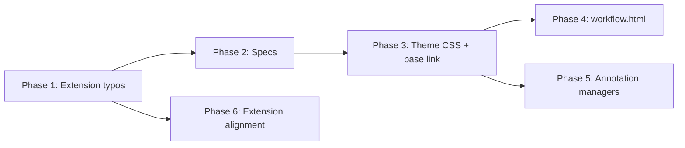

# Color System Normalization - Implementation Plan

## Current state

- [base.html](src/web/templates/base.html) already defines `:root` with `--color-brand`, `--color-text-primary`, etc. (lines 40-69). No separate CSS file is linked; styles are inline.
- [verify_text_colors.spec.ts](tests/playwright/verify_text_colors.spec.ts) uses a **predicate** for valid colors (filter with `c.includes(...)`) and a boolean **isStatusColor** expression (lines 144-151, 193-197). [workflow_executions.spec.ts](tests/playwright/workflow_executions.spec.ts) uses inline **isReadable** checks (729-733, 764-768) with the same rgb/hex strings.
- [workflow.html](src/web/templates/workflow.html) uses many `rgb(...)` and `rgba(139, 92, 246, *)` (and indigo variants) in `<style>` and inline `style=""`. rgba cannot be replaced by “var + opacity” without extra variables or `color-mix`/relative color.
- [annotation-manager.js](src/web/static/js/annotation-manager.js) injects a `<style>` block with hardcoded hex; it runs in the same document as base, so once theme vars are loaded it can use `var(--...)`.
- [browser-extension/popup.html](browser-extension/popup.html) is a **standalone document**; it does not load the app’s CSS, so it cannot use variables from theme-variables.css unless we embed a minimal `:root` in the extension.

---

## Phase 1: Fix typos in browser-extension (do first)

**File:** [browser-extension/popup.html](browser-extension/popup.html)

- In `.btn-secondary:hover`, change `background: #cbd5e0` to `background: #cbd5e1`.
- For all border/input borders using `#e2e8f0`, replace with `#e5e7eb` (search for `#e2e8f0` and replace).

No dependencies. Verifiable by grep and visual check.

---

## Phase 2: Update Playwright specs (with shared constants)

**Reduce brittleness:** Introduce named constants for readable and status RGB values; reuse in both specs. Behavior must remain identical; this is a maintainability-only change.

### 2.0 Create shared color constants

- **New file:** e.g. [tests/playwright/color-constants.ts](tests/playwright/color-constants.ts) (or `theme-color-assertions.ts`).
- Export:
  - **READABLE_TEXT_RGB:** array of strings for “valid readable” text (values that getComputedStyle may return, e.g. with spaces). Include existing plus new: white (`'255, 255, 255'`), gray-300 (`'209, 213, 219'`), gray-700 (`'55, 65, 81'`), slate heading (`'248, 250, 252'`), slate muted (`'203, 213, 225'`), body dark (`'17, 24, 39'`). Use these for `color.includes(part)` checks (so each entry is the comma-separated rgb part; spec checks `c.includes(part)` or `color.includes(part)`).
  - **STATUS_COLOR_RGB:** array of strings for status/decoration colors (so “very dark” check does not flag them): existing red/green/yellow/blue/purple plus badge and step colors from the guide.
- Helper (optional): `function isReadableColor(color: string): boolean` that returns true if `color` matches any READABLE_TEXT_RGB (e.g. `READABLE_TEXT_RGB.some(part => color.includes(part))`) or is `#ffffff` / `'white'`. Same for `isStatusColor(color)` using STATUS_COLOR_RGB. Use in both specs so logic lives in one place.

### 2.1 [tests/playwright/verify_text_colors.spec.ts](tests/playwright/verify_text_colors.spec.ts)

- Import READABLE_TEXT_RGB (and STATUS_COLOR_RGB) from the shared constants file.
- **Valid readable colors (predicate, ~lines 144-151):** Replace inline string checks with the shared constant: e.g. `validColors = actualColors.filter(c => READABLE_TEXT_RGB.some(part => c.includes(part)) || c === '#ffffff' || c === 'white')`.
- **Status/decoration allowlist (isStatusColor, ~lines 193-197):** Replace inline boolean expression with a check using STATUS_COLOR_RGB (e.g. `STATUS_COLOR_RGB.some(part => color.includes(part))`).

### 2.2 [tests/playwright/workflow_executions.spec.ts](tests/playwright/workflow_executions.spec.ts)

- Import READABLE_TEXT_RGB (or the shared `isReadableColor` helper) from the same constants file.
- **isReadable (two places, ~729 and ~764):** Replace duplicated string literals with the shared constant (e.g. `READABLE_TEXT_RGB.some(part => color.includes(part)) || color === '#ffffff' || color === 'white'`).

---

## Phase 3: Create theme CSS and wire it up

### 3.1 Create [src/web/static/css/theme-variables.css](src/web/static/css/theme-variables.css)

- Add directory `src/web/static/css/` if it does not exist.
- **Enforcement header (comment block at top of file):** State that this file is the **canonical source** for theme colors. Explicitly note that new literal hex/rgb values should **not** be introduced elsewhere in app templates or JS; new colors must be added as variables here. No functional CSS changes from this header.
- Create file with the `:root { ... }` block from the implementation guide.
- **rgba handling:** Browsers resolve `var(--purple-primary)` to a color; they do not support “var with opacity” in older syntax. Add explicit variables for borders/backgrounds used in workflow.html, for example:
  - `--purple-border-20: rgba(139, 92, 246, 0.2);`
  - `--purple-border-15: rgba(139, 92, 246, 0.15);`
  - `--purple-border-25: rgba(139, 92, 246, 0.25);`
  - `--purple-border-50: rgba(139, 92, 246, 0.5);`
  - `--purple-bg-10: rgba(139, 92, 246, 0.1);`
  - `--purple-shadow-15: rgba(139, 92, 246, 0.15);`
  - Indigo variants for `rgba(99, 102, 241, 0.12)` and `rgba(129, 140, 248, 0.1)` if we refactor those (optional; can leave as rgba in workflow for now).
- Include the button classes (`.btn-analyze`, `.btn-manage`, `.btn-execute`, `.btn-danger`) from the guide in this file so they are available app-wide.

### 3.2 Link theme in [src/web/templates/base.html](src/web/templates/base.html)

- Add `<link rel="stylesheet" href="/static/css/theme-variables.css">` in `<head>` (e.g. after the favicon, before Tailwind). This ensures theme variables (and button classes) are available on all pages that extend base, including the workflow page and any page using the annotation manager.

Do **not** remove base.html’s existing `:root` block; it can coexist. Optionally later we could alias or migrate `--color-*` to the new names; out of scope for this plan.

---

## Phase 4: Refactor workflow.html to use CSS variables

**File:** [src/web/templates/workflow.html](src/web/templates/workflow.html)

**Stability guardrails:**

- Treat newly introduced variables (e.g. `--panel-bg-1`, `--panel-bg-2`, etc.) as **ABI-stable** once added. Avoid renaming or reshaping these variables after initial introduction.
- Document (in theme-variables.css header or in a short comment in workflow.html) that **Tailwind arbitrary color classes** (e.g. `bg-[#0a0e1a]`) are discouraged and should **not** be newly introduced; use theme variables and utility classes instead.
- **Panel backgrounds:** Replace `rgb(15, 20, 35)` → `var(--panel-bg-1)`, `rgb(18, 24, 42)` → `var(--panel-bg-2)`, and so on per the guide table. Replace inline `style="background: rgb(26, 34, 56) !important"` (and similar) with `var(--panel-bg-5)`.
- **Collapsible header:** Replace `style="background-color: #1d3067"` (and JS string that sets it) with `var(--panel-header)`.
- **Text:** Replace `rgb(248, 250, 252)` and `#f8fafc` (in text context) with `var(--text-primary)`. Replace `rgb(203, 213, 225)` and `#cbd5e1` (text) with `var(--text-secondary)`. Replace `#111827` with `var(--text-body-dark)`. Replace `rgb(241, 245, 249)` (input color) with a variable (e.g. add `--text-input` in theme or reuse `--text-primary`). Replace `rgb(160, 175, 200)` and `rgb(196, 181, 253)` with variables if defined in theme (or add `--text-muted-dark`, `--text-mono`).
- **Purple:** Replace `#8b5cf6` / `#7C3AED` with `var(--purple-primary)` / `var(--purple-hover)`. Replace `rgba(139, 92, 246, 0.2)` with `var(--purple-border-20)`, and similarly for 0.15, 0.25, 0.5, 0.1, and box-shadow 0.15.
- **Input background:** Replace `#0a0e1a` in Tailwind arbitrary classes (`bg-[#0a0e1a]`) with a class that uses `var(--panel-bg-0)` (e.g. add `.bg-panel-0 { background-color: var(--panel-bg-0); }` in theme-variables.css and use that class).
- **Yellow consolidation:** Use `var(--action-warning)` for yellow accents, `var(--step-3)` for step 3 number, `var(--badge-yellow-text)` for badge text where applicable.
- **Step number colors:** Where inline styles set step colors (e.g. `#22d3ee`, `#60a5fa`), replace with `var(--step-0)`, `var(--step-1)`, etc.

Keep a single pass per “find/replace” type to avoid missed or duplicate replacements. After edits, run a quick grep for remaining `rgb(15,`, `#0a0e1a`, `rgba(139,` in workflow.html to confirm coverage.

---

## Phase 5: Refactor annotation-manager.js and annotation-manager-mobile.js

**Files:** [src/web/static/js/annotation-manager.js](src/web/static/js/annotation-manager.js), [src/web/static/js/annotation-manager-mobile.js](src/web/static/js/annotation-manager-mobile.js)

- Both inject a `<style>` block with the same semantic colors. Replace hardcoded hex with CSS variables now that theme-variables.css is loaded from base:
  - `#e5e7eb` → `var(--border-default)` (or keep if --border-default is in theme)
  - `#6b7280` → `var(--text-muted)`
  - `#16a34a`, `#15803d`, `#dcfce7` → `var(--action-success)` (and add --action-success-dark, --action-success-bg if we define them in theme)
  - `#dc2626`, `#fef2f2` → `var(--action-danger)` (and optional --action-danger-bg)
  - `#9ca3af` → `var(--text-secondary)` or keep if only --text-muted exists
  - `#2563eb` → `var(--action-info)`

Ensure theme-variables.css defines `--border-default`, `--text-muted`, `--action-success`, `--action-danger`, `--action-info` (Phase 3). If any name differs (e.g. base uses `--color-success`), use the name defined in theme-variables.css.

**Runtime safety (optional but recommended):** Add a lightweight **dev-time** check or warning if expected CSS variables (e.g. `--text-muted`, `--border-default`) are missing at runtime (e.g. when injecting styles, read a known variable via `getComputedStyle(document.documentElement).getPropertyValue('--text-muted')` and log a console warning if empty). This must **not** affect production behavior (e.g. only run in dev or log once; do not block or change UI).

---

## Phase 6: Align browser-extension/popup.html

- Extension is a separate document and does **not** load theme-variables.css. Two options:
  - **A (recommended):** Do **not** use `var()` in the extension. After Phase 1 typo fixes, optionally replace other hex values with the **same canonical hex** from the guide (e.g. `#4a5568` → `#6b7280` for muted, `#718096` → `#6b7280`) so the palette matches semantically; all values remain literal hex.
  - **B:** Add a small `<style>` in popup.html with `:root { --text-muted: #6b7280; --text-primary: #f8fafc; ... }` and then use `var(--text-muted)` etc. in the rest of the popup styles. More consistency with the app but duplicates variable definitions.

Recommend **Option A** in the plan; implementer can choose B if they want var() in the extension.

- **Optional:** [browser-extension/icons/icon16.svg](browser-extension/icons/icon16.svg) uses `#667eea`, `#764ba2`, `#4a5568`. Leave as-is or align to `#8B5CF6`, `#7C3AED`, `#6b7280` for brand consistency (guide says “optional alignment”).

---

## Post-implementation policy

Add a short **policy note** after implementation (as a comment in [theme-variables.css](src/web/static/css/theme-variables.css) header and/or in [docs/COLOR_CODE_CLUSTERS.md](docs/COLOR_CODE_CLUSTERS.md) or a brief doc):

- **No new literal hex/rgb colors** in app templates or JS; new colors must be added as variables in theme-variables.css.
- **Browser extension** remains palette-aligned but **exempt** from var() enforcement unless explicitly refactored (e.g. Option B in Phase 6).

---

## Validation (after each phase)

- Run Playwright: `npx playwright test verify_text_colors workflow_executions` (or the relevant test paths).
- Manually: workflow page (config + executions, dark theme), open execution detail modal, check panel hierarchy and View summary text; annotation menu on an article (hover states, success/error); extension popup (hover and borders).
- Grep for remaining hardcoded hex in refactored files: `grep -n '#[0-9a-fA-F]\{6\}' src/web/templates/workflow.html src/web/static/js/annotation-manager*.js` (expect only leftovers that are intentional or in strings/comments).

---

## File list summary

| #   | File                                                               | Action                                                |
| --- | ------------------------------------------------------------------ | ----------------------------------------------------- |
| 1   | browser-extension/popup.html                                       | Phase 1: typo fixes; Phase 6: optional hex alignment  |
| 2   | tests/playwright/color-constants.ts (or theme-color-assertions.ts) | Phase 2: shared READABLE_TEXT_RGB, STATUS_COLOR_RGB   |
| 3   | tests/playwright/verify_text_colors.spec.ts                        | Phase 2: use shared constants                         |
| 4   | tests/playwright/workflow_executions.spec.ts                       | Phase 2: use shared constants                         |
| 5   | src/web/static/css/theme-variables.css                             | Phase 3: create (enforcement header + rgba + buttons) |
| 6   | src/web/templates/base.html                                        | Phase 3: link theme-variables.css                     |
| 7   | src/web/templates/workflow.html                                    | Phase 4: replace rgb/hex/rgba with var()              |
| 8   | src/web/static/js/annotation-manager.js                            | Phase 5: replace hex with var(); optional dev check   |
| 9   | src/web/static/js/annotation-manager-mobile.js                     | Phase 5: same as annotation-manager.js                |
| 10  | browser-extension/icons/icon16.svg                                 | Phase 6 optional                                      |

---

## Dependency order

Phase 2 can run before or after Phase 1. Phase 4 and 5 both depend on Phase 3. Phase 6 depends only on Phase 1 for the typo fixes; optional hex alignment has no dependency on theme-variables.