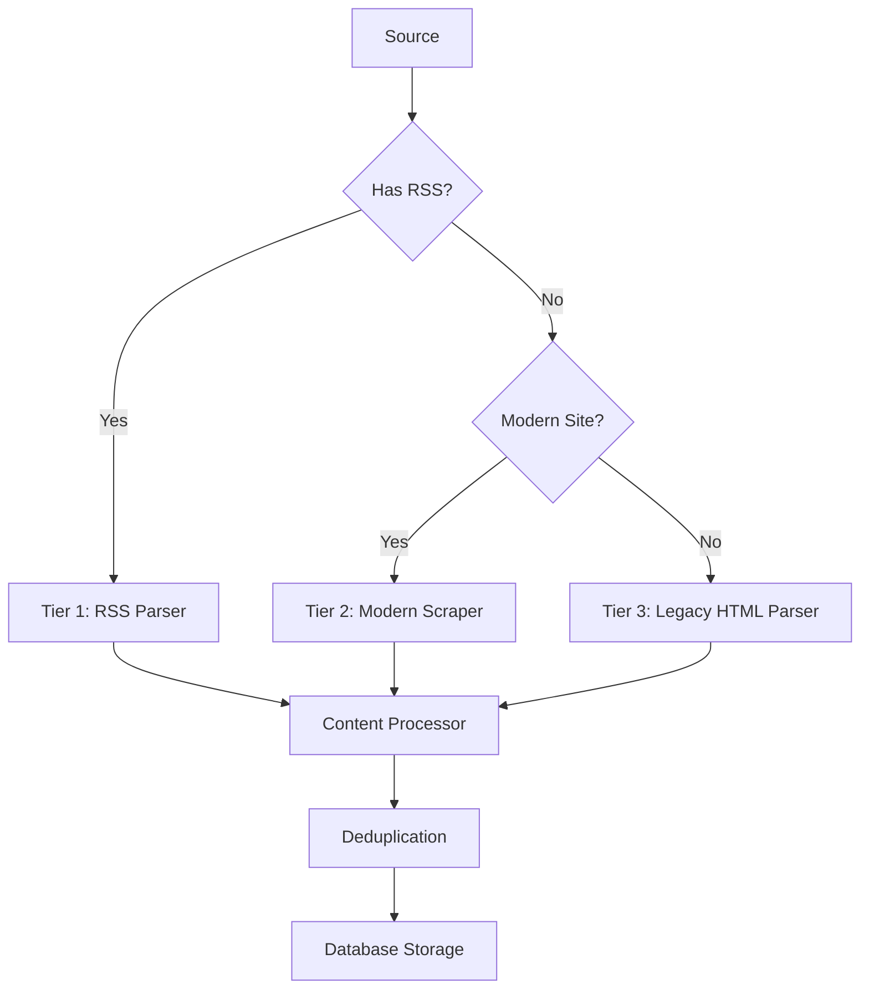

# 🔍 CTI Scraper

[](https://opensource.org/licenses/MIT)
[](https://www.python.org/downloads/)
[](https://github.com/psf/black)

A modern, asynchronous **Cyber Threat Intelligence (CTI) aggregator** that collects, processes, and analyzes threat intelligence from multiple sources using a sophisticated three-tier scraping strategy.

## ✨ Features

### 🎯 **Multi-Tier Collection Strategy**
- **Tier 1: RSS Feeds** - Fast, reliable collection from structured feeds
- **Tier 2: Modern Web Scraping** - JavaScript-enabled scraping with structured data extraction
- **Tier 3: Legacy HTML Parsing** - Fallback for older sites with basic HTML parsing

### 🚀 **Advanced Capabilities**
- **Asynchronous Processing** - High-performance concurrent collection
- **Smart Content Cleaning** - AI-powered content extraction and normalization
- **Intelligent Deduplication** - SHA256-based content fingerprinting
- **Rate Limiting & Respect** - Per-domain rate limiting with robots.txt compliance
- **Quality Scoring** - Automated content quality assessment
- **Flexible Configuration** - YAML-based source configuration with validation

### 📊 **Data Management**
- **SQLite Database** - Lightweight, embedded database for local deployments
- **Structured Data Models** - Pydantic-based validation and serialization
- **Export Capabilities** - JSON, CSV, and YAML export formats
- **Health Monitoring** - Source health tracking and failure alerting

### 🛠️ **Developer Experience**
- **Rich CLI Interface** - Beautiful command-line interface with progress indicators
- **Virtual Environment Enforcement** - Automatic virtual environment detection
- **Comprehensive Logging** - Structured logging with configurable levels
- **Type Safety** - Full type hints and validation throughout

## 🚀 Quick Start

### Prerequisites

- **Python 3.8+** (3.11+ recommended)
- **Virtual environment** (required)

### Installation

1. **Clone the repository:**
   ```bash
   git clone https://github.com/yourusername/ctiscraper.git
   cd ctiscraper
   ```

2. **Automated setup (recommended):**
   ```bash
   python3 setup_env.py
   source venv/bin/activate
   ```

3. **Manual setup:**
   ```bash
   python3 -m venv venv
   source venv/bin/activate
   pip install -r requirements.txt
   ```

### Quick Usage

```bash
# Initialize with default sources
./threat-intel init

# Collect from all active sources
./threat-intel collect

# View database statistics
./threat-intel stats

# Export collected data
./threat-intel export --format json --output threat_data.json
```

## 📖 Usage Guide

### Basic Commands

```bash
# Collection
./threat-intel collect                    # Collect from all sources
./threat-intel collect --source cisa     # Collect from specific source
./threat-intel collect --dry-run         # Test collection without saving

# Monitoring
./threat-intel monitor --interval 3600   # Monitor every hour
./threat-intel test                       # Test all source configurations

# Data Management
./threat-intel stats                      # Show database statistics
./threat-intel export --format csv       # Export as CSV
./threat-intel export --limit 100        # Limit export to 100 articles

# Source Management
./threat-intel sources list              # List all sources
./threat-intel sources add <config>      # Add new source
./threat-intel sources disable <name>    # Disable source
```

### Auto-Activating Wrapper

For convenience, use the auto-activating wrapper that handles virtual environment activation:

```bash
./threat-intel.sh collect    # Automatically activates venv
./threat-intel.sh monitor    # No manual activation needed
./threat-intel.sh stats      # Works from any shell state
```

### 🌐 Web Interface

The CTI Scraper includes a modern web interface for browsing and analyzing threat intelligence:

```bash
# Start the web server
./start_web.sh

# Or manually
source venv/bin/activate
python src/web/main.py
```

**Features:**
- 📊 **Dashboard**: Real-time overview and statistics
- 📰 **Articles**: Browse with advanced filtering and search
- 🔍 **TTP Analysis**: Interactive threat hunting technique analysis
- ⚙️ **Sources**: Source management and monitoring
- 📱 **Responsive**: Works on desktop, tablet, and mobile

**Access:** Open your browser to `http://localhost:8000`

**📖 See [WEB_INTERFACE.md](WEB_INTERFACE.md) for detailed documentation.**

## ⚙️ Configuration

### Environment Variables

Copy `.env.example` to `.env` and customize:

```bash
cp .env.example .env
```

Key settings:
```bash
# Database
DATABASE_URL=sqlite:///threat_intel.db

# HTTP Settings
REQUEST_TIMEOUT=30
RATE_LIMIT_PER_MINUTE=60

# Content Processing
MAX_CONTENT_LENGTH=100000
QUALITY_THRESHOLD=0.3

# Security (optional)
VIRUSTOTAL_API_KEY=your-api-key
SHODAN_API_KEY=your-api-key
```

### Source Configuration

Sources are defined in `config/sources.yaml`:

```yaml
cisa_advisories:
  name: "CISA Security Advisories"
  url: "https://www.cisa.gov/news-events/cybersecurity-advisories"
  rss_url: "https://www.cisa.gov/cybersecurity-advisories/advisories.xml"
  tier: 1
  enabled: true
  categories: ["government", "advisories"]
  config:
    rate_limit: 60
    timeout: 30
    max_articles: 50
```

## 🏗️ Architecture

### Component Overview

```
├── src/
│   ├── cli/           # Command-line interface
│   ├── core/          # Core scraping components
│   │   ├── fetcher.py     # Orchestrates collection strategy
│   │   ├── rss_parser.py  # RSS/Atom feed processing
│   │   ├── modern_scraper.py  # Modern web scraping
│   │   └── processor.py   # Content processing & deduplication
│   ├── database/      # Database models and management
│   ├── models/        # Pydantic data models
│   └── utils/         # Utilities (HTTP, content cleaning)
```

### Data Flow

1. **Source Loading** - YAML configuration validation and parsing
2. **Content Collection** - Three-tier scraping strategy execution
3. **Content Processing** - Cleaning, normalization, and quality scoring
4. **Deduplication** - SHA256-based content fingerprinting
5. **Storage** - SQLite database with structured models
6. **Export** - Flexible output formats (JSON, CSV, YAML)

### Three-Tier Strategy



## 🔧 Development

### Setup Development Environment

```bash
# Clone and setup
git clone https://github.com/yourusername/ctiscraper.git
cd ctiscraper
python3 setup_env.py

# Activate virtual environment
source venv/bin/activate

# Install development dependencies
pip install -r requirements.txt
```

### Code Quality

```bash
# Format code
black src/

# Lint code
flake8 src/

# Type checking
mypy src/

# Security scanning
bandit -r src/
safety check
```

### Testing

```bash
# Run tests
pytest

# With coverage
pytest --cov=src --cov-report=html

# Test specific component
pytest tests/test_rss_parser.py
```

### Adding New Sources

1. **Update `config/sources.yaml`:**
   ```yaml
   new_source:
     name: "New Threat Source"
     url: "https://example.com/threats"
     rss_url: "https://example.com/feed.xml"  # if available
     tier: 1
     enabled: true
     categories: ["private", "threat-intel"]
   ```

2. **Test the configuration:**
   ```bash
   ./threat-intel test --source new_source
   ```

3. **Collect data:**
   ```bash
   ./threat-intel collect --source new_source
   ```

## 📊 Database Schema

### Core Tables

- **`sources`** - Source configurations and metadata
- **`articles`** - Collected threat intelligence articles
- **`source_checks`** - Health monitoring and collection history
- **`content_hashes`** - Deduplication tracking
- **`url_tracking`** - URL collection tracking

### Example Queries

```sql
-- Get recent high-quality articles
SELECT title, published_at, quality_score 
FROM articles 
WHERE quality_score > 0.7 
ORDER BY published_at DESC 
LIMIT 10;

-- Source performance summary
SELECT s.name, COUNT(a.id) as article_count, AVG(a.quality_score) as avg_quality
FROM sources s 
LEFT JOIN articles a ON s.id = a.source_id 
GROUP BY s.id, s.name;
```

## 🛡️ Security

### Security Features

- **No hardcoded credentials** - All sensitive data via environment variables
- **Input validation** - Pydantic models validate all data
- **Rate limiting** - Respectful scraping with configurable limits
- **Content sanitization** - HTML cleaning and content normalization
- **Virtual environment enforcement** - Prevents system package pollution

### Security Scanning

```bash
# Scan for security vulnerabilities
bandit -r src/

# Check for known vulnerable packages
safety check

# Validate configurations
./threat-intel test --all
```

### Best Practices

1. **Use API keys** for authenticated sources when available
2. **Rotate credentials** regularly
3. **Monitor collection patterns** for anomalies
4. **Keep dependencies updated** using pinned versions
5. **Review source configurations** before deployment

## 🤝 Contributing

We welcome contributions! Please see our [Contributing Guide](CONTRIBUTING.md) for details.

### Development Workflow

1. **Fork** the repository
2. **Create** a feature branch (`git checkout -b feature/amazing-feature`)
3. **Make** your changes with tests
4. **Run** quality checks (`black`, `flake8`, `mypy`, `pytest`)
5. **Commit** your changes (`git commit -m 'Add amazing feature'`)
6. **Push** to the branch (`git push origin feature/amazing-feature`)
7. **Open** a Pull Request

### Code Standards

- **Python 3.8+** compatibility
- **Type hints** for all functions
- **Docstrings** for all public APIs
- **Tests** for new functionality
- **Black** code formatting
- **Conventional commits** for commit messages

## 📄 License

This project is licensed under the MIT License - see the [LICENSE](LICENSE) file for details.

## 🆘 Support

- **Documentation:** [Full documentation](docs/)
- **Issues:** [GitHub Issues](https://github.com/yourusername/ctiscraper/issues)
- **Discussions:** [GitHub Discussions](https://github.com/yourusername/ctiscraper/discussions)
- **Security:** See [SECURITY.md](SECURITY.md) for security policy

## 🙏 Acknowledgments

- **Feed Sources:** Thanks to all the threat intelligence providers
- **Libraries:** Built on excellent Python libraries (httpx, SQLAlchemy, Pydantic, Rich)
- **Community:** Inspired by the cybersecurity and threat intelligence community

---

**⚡ Ready to aggregate threat intelligence? Get started with `./threat-intel init`!**