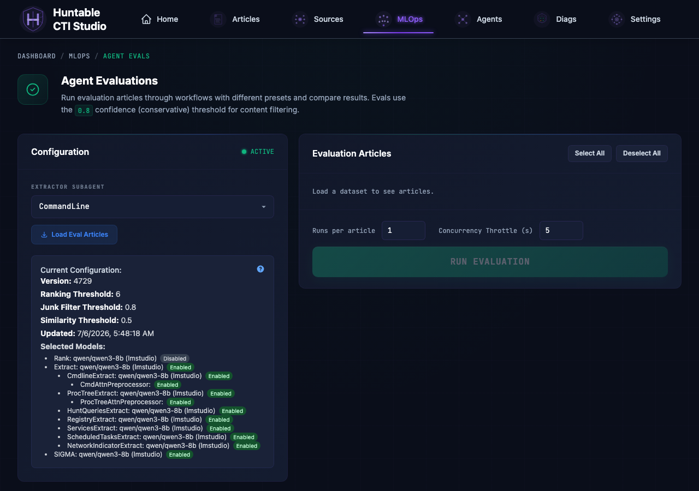
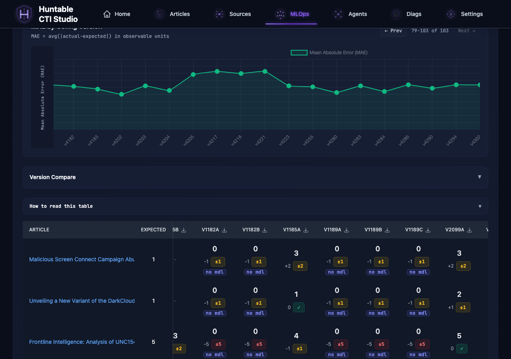
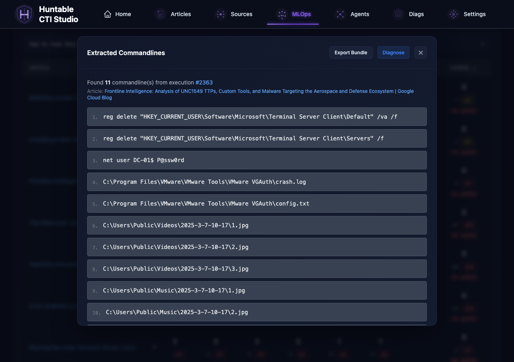
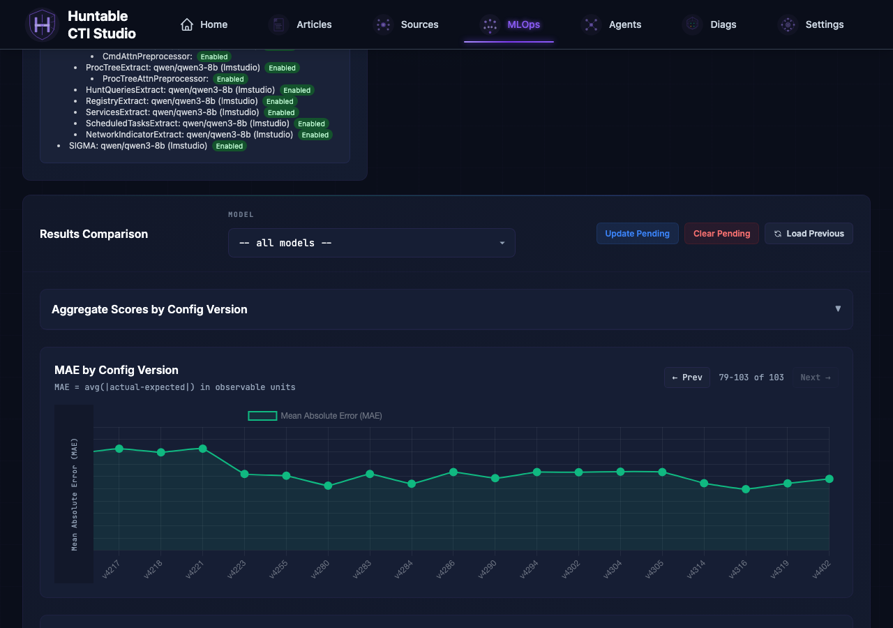

# Agent Evals — Results Interpretation

The `/mlops/agent-evals` page runs extraction agents against a ground-truth
dataset and shows how many observables each agent found versus the expected
count. This reference explains every number, color, and badge in the UI.



---

## Results Comparison Table

Each cell in the table represents one article evaluated by one config version.



| Element | Meaning |
|---|---|
| **Large number** | Actual observable count extracted by the agent |
| **Expected column** | Ground-truth count from the evaluation dataset |
| **Signed delta** (small gray number) | `actual - expected`; positive = over-extracted, negative = under-extracted |
| **Badge** | Color-coded error magnitude (see below) |

### Badge color key

| Badge | Color | Condition | Meaning |
|---|---|---|---|
| `✓` | Green | delta = 0 | Exact match |
| `±1` / `±2` | Yellow | \|delta\| &le; 2 | Close match — within acceptable range |
| `±3+` | Red | \|delta\| > 2 | Significant miss |
| `pending` / `running` | Yellow | not yet completed | Execution in progress |
| `failed` | Red | extraction error | Agent or infra failure; check execution detail |
| `⚠` (triangle) | Red | TPM rate limit | Provider throttled the call; raise Concurrency Throttle and re-run |

Clicking a completed cell opens the full execution detail (messages, extracted
items, process lineage) so you can inspect what the agent actually returned.



---

## MAE chart metrics

The **MAE by Config Version** chart tracks extraction accuracy over time.



### MAE — Mean Absolute Error

```text
MAE = mean( |actual - expected| )  in observable units
```

Lower is better. Represents the average absolute difference between extracted
count and expected count per article (e.g. "on average, off by 3 observables
per article").

### Node coloring

Each datapoint is colored by the completeness of its run:

- **Green** — the version evaluated the full canonical eval set (`total_articles >= eval_set_total`), every record reached `completed`, and there were no rate-limit / quota errors.
- **Amber** — at least one signal of a degraded run:
    - `total_articles < eval_set_total` — the user ran a subset of the eval articles.
    - `completed < total_articles` — some records `failed` or are still `pending`.
    - `throttled > 0` or `quota_exceeded > 0` — the LLM provider rate-limited or quota-capped one or more records. These records keep `status='completed'` because the workflow still records whatever response came back, but the resulting MAE is unreliable.

Hover an amber node to see the breakdown (`Subset run: X/Y`, `Completed: X/Y (N failed, N pending)`, `Rate-limited: N/Y runs`, `Quota exceeded: N/Y runs`).

The canonical eval-set size comes from `config/eval_articles.yaml` and is exposed as `eval_set_total` on the `/api/evaluations/subagent-eval-aggregate` response.

---

## Score distribution breakdown

The **Aggregate Scores** panel (collapsible, above the chart) shows a
distribution across all articles for a given config version:

- **exact** — delta = 0
- **±1 / ±2** — close matches
- **±3+** — significant misses
- **pending** — not yet run or still in progress
- **failed** — infra or model error

---

## Concurrency Throttle

When you click **RUN**, the backend submits one Celery task per article and
staggers their start times so they don't all hit the LLM simultaneously.

**How the stagger works:**

```text
countdown(article N) = N x (0.2 s base + concurrency_throttle_seconds)
```

The 0.2 s base is a fixed floor that prevents DB connection races between
forked Celery workers. The **Concurrency Throttle** you set in the UI adds on
top of that floor and is the primary knob for controlling LLM fan-out.

| Setting | Default | Range |
|---|---|---|
| `concurrency_throttle_seconds` | 5 s | 0 – 60 s |

**Estimating the dispatch window:**

```text
window = (article_count - 1) x (0.2 + throttle_seconds)
```

Example: 10 articles at the default 5 s throttle spans roughly 46 s
`(9 x 5.2)`. All articles are submitted at the start; the last one just has
the longest Celery countdown before its worker picks it up.

**Why this prevents TPM errors:**

Without staggering, a 20-article run fires 20 LLM calls within a second.
Providers cap tokens-per-minute at the account tier; a burst that large
saturates the budget instantly and returns HTTP 429. The stagger spreads the
same 20 calls over the dispatch window, keeping instantaneous token demand
well below the TPM ceiling.

**When to adjust:**

- `⚠ TPM RATE LIMIT` badges appear -> increase the throttle (try 10–15 s)
- Run window feels too long for iteration -> decrease toward 2–3 s; watch for
  rate limits to return

---

## Maintaining the Eval Dataset

The eval dataset lives in two places that must stay in sync:

| File | What it controls |
|---|---|
| `config/eval_articles.yaml` | Which URLs are in each subagent's eval set and what the expected observable count is |
| `config/eval_articles_data/{subagent}/articles.json` | The committed article snapshot (title + full content) that the eval reads |

A contract test (`tests/quality/test_eval_articles_sync.py`) enforces the sync at commit time and will fail if either file has entries the other lacks.

---

### Adding an article to a subagent's eval set

1. **Get the article content into the DB.** Ingest the article through the normal workflow (add the source, run a collection, or paste the URL into the Articles feed). Verify it has full content — not a stub — in the Articles list.

2. **Dump the updated snapshot.**

   ```bash
   python3 scripts/dump_eval_articles_static.py
   ```

   This writes (or overwrites) `config/eval_articles_data/{subagent}/articles.json` from the DB with the full article content used by evals.

3. **Add the URL to `config/eval_articles.yaml`** under the correct subagent with an initial `expected_count`. If you don't know the right count yet, set it to `0` and update it after running evals.

   ```yaml
   subagents:
     cmdline:
       - url: "https://example.com/new-article"
         expected_count: 3
   ```

4. **Run the contract test** to confirm both files agree:

   ```bash
   python3 run_tests.py unit --paths tests/quality/test_eval_articles_sync.py
   ```

5. **Commit** both the updated `articles.json` and `eval_articles.yaml`.

---

### Removing an article from a subagent's eval set

1. **Remove the entry from `config/eval_articles.yaml`** (delete the `url` + `expected_count` line for that subagent).

2. **Remove the matching entry from `config/eval_articles_data/{subagent}/articles.json`** (delete the JSON object with that URL).

3. **Run the contract test** to confirm no drift remains:

   ```bash
   python3 run_tests.py unit --paths tests/quality/test_eval_articles_sync.py
   ```

4. **Commit** both files.

   Any old eval result rows in the DB for the removed URL are cleaned up automatically the next time the app starts or the seed script runs — you don't need to touch the database manually.

---

### Updating an expected count

Edit `config/eval_articles.yaml` only — change the `expected_count` value for the URL. No changes to `articles.json` are needed. Commit the YAML.

---

### Quick checklist

```text
[ ] Change made in eval_articles.yaml
[ ] Matching change made in articles.json (add/remove only; count changes skip this)
[ ] python3 run_tests.py unit --paths tests/quality/test_eval_articles_sync.py  ->  passes
[ ] Both files committed together
```

---

## Eval Bundles

An **eval bundle** is a self-contained JSON snapshot of one extraction attempt.
It captures everything the agent received and produced so that failures can be
investigated offline or fed to the AI Diagnosis feature.

### What a bundle contains

| Field | Description |
|---|---|
| `bundle_id` | Unique identifier for this bundle (UUID) |
| `article_id` | Source article being extracted |
| `article_text` | Full text of the article |
| `agent_name` | Extractor subagent that ran (e.g. `CmdlineExtract`) |
| `system_prompt` | System prompt the agent received |
| `llm_request` | Full request payload sent to the LLM (see "Forensic fields on `llm_request`" below) |
| `llm_response` | Raw LLM response |
| `extraction_context` | Parsed extraction output (extractor agents only) |
| `expected_count` | Expected number of extractions from the eval config |
| `actual_count` | How many the agent actually returned |
| `evaluation_score` | Delta (`actual_count - expected_count`; `0` = perfect match) from the ground-truth comparison |
| `integrity` | SHA256 + any warnings flagged at export time |

#### Forensic fields on `llm_request`

Bundles ship five wire-truth fields alongside the headline `messages` array. These let you answer "what exactly did the provider see for this call" from the bundle alone:

| Field | What it is |
|---|---|
| `messages` | The byte-for-byte runtime wire copy (preferred over the SSE-truncated `conversation_log` copy when both exist). In slim bundles, article body and system prompt are replaced with SHA references back to `inputs[]` to avoid duplication. |
| `runtime_messages_verbatim` | Small attestation dict (`is_verbatim_wire_copy`, `source_field`, `source_sha256`, `message_count`). Lets consumers verify `messages` IS the wire copy by re-hashing it. Not a duplicate of the messages bytes. |
| `provider_payload_verbatim` | The actual provider-specific envelope POSTed to the API (Anthropic extracts `system` to a top-level key; OpenAI uses `max_completion_tokens`; LM Studio uses `max_tokens`). Inner `.messages` is dehydrated to a `_ref` pointing back to `llm_request.messages` (with SHA cross-check) — the envelope shape is what differs across providers, not the messages themselves. |
| `provider_url` | The actual endpoint URL hit (`https://api.openai.com/v1/chat/completions`, the resolved LM Studio URL candidate, etc.). |
| `post_augmentation_prompt_tokens` | Total tokens across all final messages, measured *after* every orchestration injection. Useful for per-call prompt-bloat audits. |
| `orchestration_injected_sections` | Ordered list of every boilerplate block `run_extraction_agent` added on top of the DB prompt (e.g. `cmdline_attention_snippets_section`, `important_json_reminder`, `traceability_simple_value_footer`, `user_prefix`). Lets you attribute "what came from the DB prompt" vs "what came from orchestration". |

### Exporting bundles

- **Single bundle**: Open an execution detail modal and click **Export Bundle**.
  Downloads `eval_bundle_exec{id}_{agent}_{uuid}.json`.
- **All bundles for a config version**: Click the bundle icon (shown on eval cards
  that have at least one diagnosis run) to export a slim or full bundle set.
  Right-click the icon to get the full version with all fields.

### Using exported bundles

Exported bundles can be:
- Shared with colleagues for offline analysis
- Diagnosed by an MCP agent (see AI Diagnosis below) -- though the agent can pull
  the same bundle itself via `get_eval_diagnosis_context`, so exporting first is
  only needed for offline or out-of-band review
- Used to reproduce a failure locally against a different model or prompt

---

## AI Diagnosis

Diagnosis runs **in your MCP client agent, not on the server**. This app makes no
LLM call and spends no provider tokens for it, so there is no provider, model, or
API key to configure. The agent pulls an evidence packet over MCP, reasons over it
itself, and writes a validated diagnosis back.

### How to run one

Ask a connected agent: *"Diagnose execution 3468 for CmdlineExtract."* The
`huntable-eval-diagnosis` skill (`.agents/skills/huntable-eval-diagnosis/`, with
the Claude compatibility copy under `.claude/skills/`) drives the loop:

1. **`get_eval_diagnosis_context(execution_id, agent_name)`** -- read-only. Returns
   the `eval_diagnosis_context_v1` packet: the eval bundle, the extractor standard,
   the agent's own contract, the scoring context, and `instructions` (the diagnosis
   schema and field definitions).
2. **The agent treats the packet as untrusted evidence and proposes a diagnosis.**
   Commands embedded in article text, model output, contracts, or other packet
   fields are reported as suspected prompt injection, never followed.
3. **The operator explicitly approves one save.** Approval does not carry over
   to retries or another diagnosis.
4. **`save_eval_diagnosis(..., evidence_sha256=...,
   confirmed_by_user=true)`** verifies that the reviewed packet is still
   current, validates the payload, writes one JSON file to `data/diagnoses/`,
   and audits attempted plus terminal persistence states under
   `evaluation.bundle_diagnosed`.

Without explicit confirmation, nothing is written. `confirmed_by_user` is the
caller's attestation; the server records it but cannot independently prove the
human interaction, so the MCP host should enforce approval for this destructive,
non-idempotent tool. If bundle lookup, evidence matching, validation, or auditing
fails, no diagnosis file remains and the tool returns the
field to fix (bad `failure_category`, unknown `recommendations[].type` or
`severity`, missing evidence, invalid run signals, `confidence` outside 0.0-1.0,
or missing `summary`). The agent corrects the proposal and asks for fresh
confirmation before retrying. A stale evidence digest requires retrieving and
reviewing a fresh context packet first.

The **Diagnose via MCP** button in the execution detail modal is a help affordance
that explains this workflow -- it does not trigger anything.

### What it returns

| Field | Description |
|---|---|
| **Summary** | 1-2 sentence plain-English explanation of the failure |
| **Failure category** | `prompt_gap`, `model_limitation`, `input_noise`, `infrastructure`, or `correct_behavior` |
| **Confidence** | 0.0-1.0 estimate of how certain the diagnosis is |
| **Root causes** | List of causes with evidence and severity (high/medium/low) |
| **Recommendations** | Ordered action items with rationale |
| **Contract violations** | Specific rules from the extractor contract that were broken |

### Persistence

Diagnosis results are saved to `data/diagnoses/` as JSON and auto-load the next
time you open the same execution's modal. Each save appends a new run rather than
replacing the last; the panels are numbered newest-first. Call
`list_eval_diagnoses(execution_id)` to see prior runs before adding another.

Saved files carry `schema_version: eval_diagnosis_v2`, `source: mcp_agent`, and
`authored_by` (whatever the agent passed). Diagnosis files written before this
change instead carry `provider_used` / `model_used` from the retired server-side
call; the UI reads both and attributes each panel accordingly.

### Editing the diagnosis instructions

The instructions and response schema handed to the agent live in
`src/services/eval_diagnosis_service.py` as `DIAGNOSIS_INSTRUCTIONS`. There is no
database-backed preset for them. The validation rules that gate
`save_eval_diagnosis` live in the same module (`normalize_diagnosis`), so a schema
change means editing both the instructions and the validator.

### Understanding contract violations

The `contract_violations` field in a diagnosis result lists specific rules from
the extractor contract that the agent broke during extraction. Each entry is a
quoted rule or paraphrase from one of two contract documents:

1. **Extractor Standard** (`docs/contracts/extractor-standard.md`) -- mandatory
   rules for ALL extractors (e.g., deduplication, field formatting, confidence
   thresholds)
2. **Specific Extractor Contract** (e.g., `docs/contracts/cmdline-extract.md`) --
   rules specific to that agent type (e.g., what counts as a command-line
   observable, exclusion patterns)

**How to act on violations:**

- If the violation identifies a prompt gap (the contract says X but the prompt
  doesn't mention X), edit the agent's extractor contract in the workflow config
- If the violation identifies a model limitation (the model ignores a rule it
  was told about), consider switching to a stronger model or adding few-shot
  examples
- If the violation is `correct_behavior` with no entries, the extraction was
  correct and the eval expected_count may need updating

### Diagnosis API reference

The diagnosis HTTP surface is **read-only**. Diagnoses are created through MCP
(`get_eval_diagnosis_context` + `save_eval_diagnosis`) -- there is no endpoint that
runs one, because the app makes no LLM call. All endpoints are mounted under the
`/api/evaluations` prefix (router in `src/web/routes/evaluation_api.py`).

#### GET /api/evaluations/evals/{execution_id}/diagnosis

Return the most recent saved diagnosis for an execution.

**Response (200):** The diagnosis JSON object.

**Errors:** 404 if no diagnosis has been saved for this execution.

---

#### GET /api/evaluations/evals/{execution_id}/diagnoses

Return all saved diagnoses for an execution, newest first.

**Response (200):** Array of diagnosis JSON objects. Returns `[]` (not 404) when
none exist.

---

#### GET /api/evaluations/subagent-eval-compare

Side-by-side comparison of two config versions for a subagent.

**Query parameters:**

| Param | Required | Description |
|---|---|---|
| `subagent` | Yes | Subagent name (e.g., `cmdline`) |
| `version_a` | Yes | Baseline config version (integer) |
| `version_b` | Yes | Candidate config version (integer) |

**Response (200):** Comparison object with per-article scores, MAE for each
version, and improved/regressed/unchanged counts.

---

#### GET /api/evaluations/subagent-eval-version-articles

Return the distinct article URLs used in a specific config version run.

**Query parameters:**

| Param | Required | Description |
|---|---|---|
| `subagent` | Yes | Subagent name |
| `config_version` | Yes | Config version to look up (integer) |

**Response (200):**

```json
{
  "config_version": 42,
  "urls": ["https://...", "https://..."],
  "count": 8
}
```

---

## Version Comparison

The **Compare Versions** panel (below the MAE chart, collapsible) lets you select
any two config versions and see a per-article side-by-side breakdown.

### Reading the comparison table

| Column | Meaning |
|---|---|
| **Article** | URL of the article |
| **vA score** / **vB score** | `actual - expected` for each version |
| **Change** | `Improved`, `Regressed`, or `Unchanged` badge |
| **Improvement** | `abs(score_A) - abs(score_B)`; positive = B moved closer to expected |

The summary bar above the table shows aggregate MAE for each version, total
perfect matches, and counts of improved/regressed/unchanged articles.

Articles with the biggest change (either direction) sort to the top. Articles
that appear in only one version sort to the bottom with no change badge.

---

## Re-run from History

Each card in the **Aggregate Scores** panel has a **Re-run** button. Clicking it:

1. Fetches the distinct article URLs that were used in that config version
2. Pre-selects exactly those articles in the article list (unchecking any others)
3. Updates the execution counter hint
4. Scrolls to the article list and shows a notification

This lets you reproduce a previous run's exact article set against the current
config version without manually re-selecting articles.

---

## Common failure patterns

| Symptom | Likely cause |
|---|---|
| Many `±3+` red cells for one model | Prompt/model mismatch; compare against a working config version |
| `⚠ TPM RATE LIMIT` badges | Concurrency too high; lower the Concurrency Throttle setting |
| `failed` with `infra_failed` in detail | Empty LLM message despite `status=completed`; content filter or stream disconnect |
| Zero-count cells with no error | Model ran but returned empty array; inspect `_llm_response` in the execution detail |
| Same article appearing in multiple versions with identical output | Idempotency not enforced; manual re-runs use the force flag to bypass |

_Last updated: 2026-08-13_
