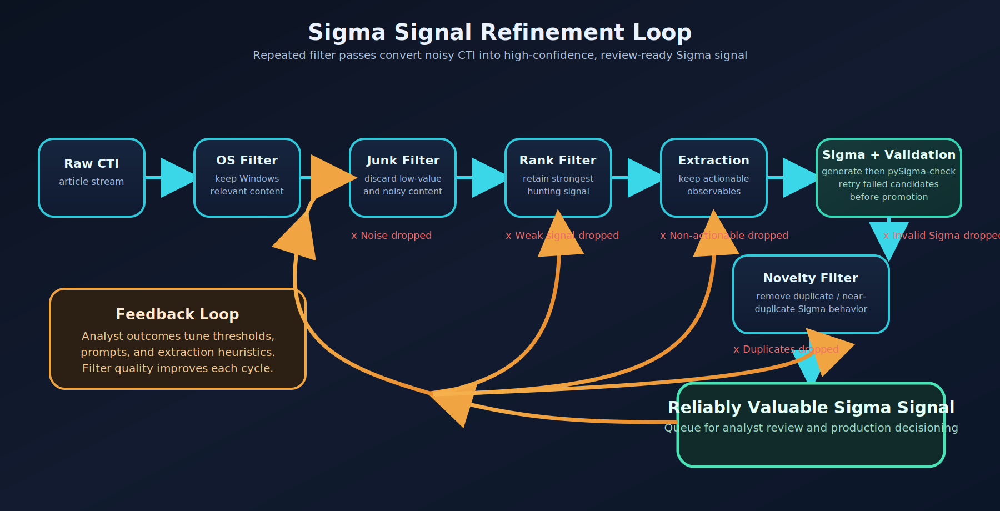

# Sigma Rules

## Overview

Sigma rules are generated from threat intelligence articles by the workflow's
Sigma agent, validated with pySigma, and scored for behavioral novelty against
the indexed SigmaHQ repository before being queued for human review.

Three capabilities work together:

1. **Rule generation**: LLM produces Sigma YAML from extracted observables;
   pySigma validates the output.
2. **Rule matching**: Articles are matched to the indexed rule corpus (SigmaHQ
   plus your customer repo, if indexed) using behavioral overlap scoring to
   determine coverage status.
3. **Similarity search**: Generated rules are compared against the same indexed
   corpus to detect duplication and classify novelty.

These last two are distinct pipelines with different inputs and scoring
mechanisms. Rule matching is **article-centric** — it asks whether an existing
rule already covers the behaviors described in a CTI article. Similarity search
is **rule-centric** — it asks whether a newly generated Sigma rule is
behaviorally novel relative to what is already indexed. Both query the same
`sigma_rules` table, so customer repo rules participate in both once indexed.

!!! warning "Your rules are not included by default"
    SigmaHQ rules are indexed automatically during setup. Rules from your own
    approved repo are **not** — you must index them manually and re-run whenever
    the repo changes:

    ```bash
    ./run_cli.sh sigma index-customer-repo
    ```

    Until you do, coverage classification and similarity search only compare
    against the SigmaHQ corpus. Run `sigma stats` to confirm how many customer
    rules are currently indexed.

### System Flow

Two entry paths lead into Sigma rule processing:

- **Agentic Workflow** (primary): Triggered via `POST /api/workflow/articles/{id}/trigger` — OS Detection → Junk Filter → Rank → Extract → Generate Sigma → Similarity Search → Promote to Queue
- **Web/API path**: `POST /api/articles/{article_id}/generate-sigma` — Match Existing Rules → Classify Coverage → Generate New Rules (if needed) → Similarity Check → Store

### Signal Refinement Loop



---

## Rule Generation

### Process

1. Content and extracted observables are passed to the Sigma generation LLM.
2. The LLM produces Sigma YAML with an additional `observables_used` field
   (not a valid Sigma field — stripped before pySigma validation).
3. pySigma validates the rule; if it fails, the error is injected into the next
   prompt and the LLM retries. Maximum 3 attempts.
4. The final rule and full attempt log are stored in
   `agentic_workflow_executions.sigma_results`.

Generation uses temperature 0.2 for deterministic output.

### Iterative Retry

- Up to 3 attempts per rule set (initial generation)
- Validation errors from pySigma are fed back into the next prompt
- All attempt logs (prompts, responses, validation results) are stored for
  post-mortem review

### Repair Pass (SigmaRepair)

After the initial generation attempt, any rules that failed pySigma validation
are sent through a dedicated per-rule repair loop before the result is finalized.

**How it works:**

1. Invalid rules are collected after the generation/validation phase.
2. For each invalid rule, the `SigmaRepair` prompt is called with two injected
   values:
   - `{validation_errors}` -- the list of pySigma error strings from the failed
     attempt
   - `{original_rule}` -- the first 500 characters of the broken YAML
3. The LLM returns a corrected rule; pySigma re-validates it.
4. This repeats up to `max_repair_attempts_per_rule` times (default: 3) per rule.

**Implementation:** `src/services/sigma_generation_service.py` --
`SigmaGenerationService._repair_rules()`

**Prompt source:** `src/prompts/sigma_repair_single.txt` (seed default). The
live prompt is stored in the database under the `SigmaRepair` key in the
workflow config's `agent_prompts` and can be edited in **Settings -> Workflow
Config -> SigmaRepair**. The DB value takes precedence over the seed file at
runtime.

### Conversation Log Display

The article UI renders the LLM ↔ pySigma conversation:

- One card per attempt with pass/fail indicator
- Collapsible prompt and response blocks
- pySigma error detail when a rule fails validation

### Prerequisites

- AI model configured (OpenAI API key, or LMStudio local server)
- pySigma installed (bundled in requirements)
- For article-to-rule matching (pgvector path): Sigma rules indexed (`sigma index-metadata` then
  `sigma index-embeddings`). Note: the rule novelty/deduplication path uses Jaccard×Containment
  scoring and does not require embeddings — only `sigma index-metadata` is needed for it.
- Threat hunting score < 65 shows a warning but does not block generation

---

## Rule Matching Pipeline

A three-layer pipeline matches CTI articles to existing Sigma rules from
SigmaHQ, classifies coverage, and gates new rule generation.

### Architecture Components

#### Database Schema

**`sigma_rules`** — stores indexed SigmaHQ rules:
- 768-dimensional pgvector embeddings (`intfloat/e5-base-v2`)
- JSONB fields for logsource and detection logic
- Full metadata: tags, level, status, author, references
- Source tracking: `file_path`, `repo_commit_sha`
- Canonical fields: `logsource_key`, `canonical_class` (precomputed for novelty scoring)

**`article_sigma_matches`** — stores article-to-rule matches:
- Similarity scores, match levels (article/chunk)
- Coverage classification: `covered`, `extend`, `new`
- Matched behaviors: discriminators, LOLBAS, intelligence indicators

#### Sigma Sync Service

**File**: `src/services/sigma_sync_service.py`

Clones/pulls the SigmaHQ repository, parses YAML rule files, generates
embeddings, and batch-indexes rules. Incremental updates only index new rules.

Key methods: `clone_or_pull_repository()`, `find_rule_files()`,
`parse_rule_file()`, `index_metadata()`, `index_embeddings()`, `index_rules()`

#### Sigma Matching Service

**File**: `src/services/sigma_matching_service.py`

- Article-level and chunk-level semantic search using pgvector cosine similarity
  for candidate retrieval
- Behavioral novelty scoring for final similarity assessment (see
  [Novelty Service Architecture](#novelty-service-architecture))
- Configurable candidate retrieval limits and matching threshold

#### Coverage Classification Service

**File**: `src/services/sigma_coverage_service.py`

Extracts behaviors from `chunk_analysis_results`, compares them to rule
detection patterns, and classifies each match. The underlying query has no
source filter, so customer repo rules (prefix `cust-`) are candidates alongside
SigmaHQ rules whenever they have been indexed — see
[Customer Repo Rules](#customer-repo-rules).

| Status | Condition |
|---|---|
| `covered` | Similarity ≥ 0.85 and behavior overlap ≥ 0.7 |
| `extend` | Similarity ≥ 0.7 and overlap ≥ 0.3 |
| `new` | Low overlap — new detection opportunity |

### Enhanced Generation Workflow

**File**: `src/web/routes/ai.py`

1. Match article to existing rules (threshold 0.7)
2. Classify each match (`covered` / `extend` / `new`)
3. Store matches to database
4. If ≥ 2 rules are `covered`: skip generation, return matches
5. Otherwise: proceed with LLM generation

### Embedding Strategy

All Sigma embedding operations use `intfloat/e5-base-v2` via local
sentence-transformers (768 dimensions). Article embeddings already stored in
`articles.embedding` are reused; chunk embeddings are generated on-demand from
`chunk_analysis_results`. Rule embeddings combine title + description +
logsource + tags.

---

## Similarity Search

Compares generated rules against indexed SigmaHQ rules to detect duplication
and score novelty.

### How It Works

```
Generated Rule
  1. Extract detection atoms via sigma_similarity (live or index-time precompute)
  2. Phase 1 candidate retrieval — two paths:
       (a) canonical_class path: filter sigma_rules.canonical_class = X (no LIMIT)
       (b) logsource_key fallback: filter sigma_rules.logsource_key = X (LIMIT 20)
     Each candidate is tagged with the phase1_path it came from.
  3. Phase 2 scoring — Jaccard × Containment − Filter over atom sets
  4. Phase 3 safety gate (scoped) — drop logsource_key mismatches ONLY on the
     logsource_key-fallback path. The canonical_class path's SQL filter is the
     authoritative scoping; gating it would re-impose the narrower predicate the
     canonical_class column was created to escape (Spec Item 6, Option B per
     2026-06-01 4c measurement).
  5. Return top matches above threshold, sorted by similarity descending
```

Step 1 extracts atoms from all three Sigma selection shapes:

| Shape | Example | Atom production |
|---|---|---|
| Single map | `selection: { Image\|endswith: '\foo.exe' }` | Field-bearing atom per field/value pair |
| List of maps | `selection: [{...}, {...}]` | Implicit OR of indicator sets; each map produces field-bearing atoms |
| List of scalars | `keywords: ['<script>', 'onerror=']` (or any selection name) | Field-less keyword atom per scalar — `field=""`, `op="contains"`, polarity derived from the condition (`not <key>` → negative; otherwise positive) |

Mixed lists (dicts and scalars in the same list — rare but legal) split across the second and third paths.

**Atom-less rules → `NOVEL`.** If no detection atoms can be extracted — i.e., truly
degenerate cases like a selection with an empty dict (`selection: {}`) or detection
shapes the extractor doesn't model at all — the rule has no behavioral fingerprint
to compare. Rather than risk a false `DUPLICATE` (an empty canonical form would
hash to one shared `exact_hash` across every such rule), `generate_exact_hash`
returns `None` (leaving the DB column NULL so SQL `IS NULL` semantics prevent any
match) and `assess_novelty` short-circuits to `NOVEL`. The two guards compose:
the hash-side guard closes the upstream root cause; the assess-side guard is
defense-in-depth. In the current live corpus, every indexed rule produces atoms
and a distinct `exact_hash` — the atom-less population is 0 — but the guards stay
in place for malformed or unmodeled rules that may arrive in the future.

### Behavioral Novelty Scoring

**Precomputed atom path** (stored atom columns are available):

```
novelty_score = 1 - similarity_score
similarity_score = (atom_jaccard × containment) − filter_penalty
```

Where:
- `atom_jaccard` = |atoms(A) ∩ atoms(B)| / |atoms(A) ∪ atoms(B)|
- `containment` = a categorical factor B ∈ {1.0, 0.85, 0.75, 0.65} expressing how
  far one rule's atoms subsume the other's. It is **not** a raw ratio; it is bucketed
  from `overlap_ratio_a`, `overlap_ratio_b`, and `surface_ratio` (see below).
- `filter_penalty` = reduction when one rule's filters would exclude the other's detection

The intermediate ratios fed into containment:

```
overlap_ratio_a = |intersection| / |atoms(A)|
overlap_ratio_b = |intersection| / |atoms(B)|
surface_ratio   = |surface(A) − surface(B)| / max(surface(A), surface(B))
```

The bucket (`containment_factor` shown in the UI as "Containment") is selected by:

| Bucket | Condition | B |
|---|---|---|
| Equivalent | `overlap_a ≥ 0.9` and `overlap_b ≥ 0.9` and `surface_ratio ≤ 0.10` | **1.00** |
| Subset (A ⊂ B) | `overlap_a ≥ 0.9` and `surface(A) < surface(B)` | **0.85** |
| Superset (A ⊃ B) | `overlap_b ≥ 0.9` and `surface(A) > surface(B)` | **0.75** |
| Else (no clear subset relationship) | (default) | **0.65** |

So a 65% Containment in the UI means *"neither rule is a clean ≥90% subset of the other"* — the floor value, not a literal "65% of atoms overlap."

#### Surface (DNF branches)

`surface_score` = number of branches the detection has after being expanded to
**Disjunctive Normal Form**. Conceptually: *how many distinct shapes of event can
trigger this rule?*

- Every `AND` keeps everything in one branch.
- Every `OR` (explicit `or`, list of selections, `1 of selection_*`, list-valued
  selection blocks) doubles or multiplies the branches.

Code: `sigma_atom_similarity/sigma_similarity/surface_estimator.py`.

##### Worked example

Two rules that both involve `php.exe`:

**Rule A — PowerShell Spawning PHP** (surface = 1):

```yaml
detection:
  selection_parent:
    ParentImage|endswith: \powershell.exe
  selection_image:
    Image|endswith: \php.exe
  selection_cli:
    CommandLine|contains|all:
      - \AppData\Roaming\php\
      - -d extension=zip
  condition: selection_parent and selection_image and selection_cli
```

Pure AND of three selections → **one** way to satisfy it → surface = 1.

**Rule B — Php Inline Command Execution** (surface = 2):

```yaml
detection:
  selection_cli:
    CommandLine|contains: " -r"
  selection_img:
    - Image|endswith: \php.exe          # branch A
    - OriginalFileName: php.exe         # branch B
  condition: all of selection_*
```

The list under `selection_img` is implicit OR. After DNF expansion:
`(cli ∧ Image=\php.exe) OR (cli ∧ OriginalFileName=php.exe)` → **two** ways to
satisfy it → surface = 2.

##### Why it's displayed alongside Jaccard and Containment

Surface is the denominator behind the Subset / Superset buckets in containment.
A 1-branch rule whose atoms are ≥90% inside a 2-branch rule earns *Subset*
(B = 0.85), which is a stronger signal than the atom counts alone would suggest:
*"every event this narrower rule fires on, the broader rule could also fire on
via one of its branches."* High Containment + low Jaccard + asymmetric Surface
is the classic **narrow-rule-inside-broader-rule** pattern — not a duplicate,
but the broader rule already covers your behavior.

If Surface ever looks wildly off (e.g. dozens of branches for a simple-looking
rule), it usually means a nested `1 of` / wildcard selection-name pattern blew
up the DNF, which feeds back into a noisy Containment score. Surface is also
the trigger for the `dnf_expansion_limit` reason flag, which short-circuits the
comparison to "Skipped (unsupported rule type)" in the UI.

**Cross-field soft matching**: When strict atom intersection is empty, value-based
soft matching applies across process-executable fields (`Image`, `CommandLine`,
`ParentImage`, `ParentCommandLine`, `OriginalFileName`, and their canonical
`process.*` variants). Same executable value in different fields awards
50%-dampened partial Jaccard credit, preventing 0% similarity between rules
detecting the same binary via different Sigma fields.

#### When atom extraction runs

`SigmaNoveltyService.assess_novelty` uses a **single scorer** (`compare_precomputed_semantics`)
over atom sets from the `sigma_similarity` package. The in-app YAML re-parse scorer
(atom Jaccard 70% + logic shape 30%) was retired in 2026-06-10.

| Stage | Function | `require_canonical_class` | Purpose |
|---|---|---|---|
| Index / backfill | `precompute_atom_fields()` | `True` (strict) | Store `canonical_class`, `positive_atoms`, `negative_atoms`, `surface_score` only for explicitly modeled telemetry classes |
| Comparison (proposed rule) | `extract_atom_fields()` | `False` | Live atom extraction even when `canonical_class` is unresolved |
| Comparison (candidate w/o stored atoms) | `extract_atom_fields()` | `False` | Same live extraction for corpus rows missing precomputed columns |

For each (proposed, candidate) pair:

1. Proposed rule atoms come from `extract_atom_fields(proposed_rule, require_canonical_class=False)`.
2. If the candidate has stored `positive_atoms`, compare against those.
3. Else, live-extract the candidate the same way.
4. If either side cannot produce atoms, the candidate is **skipped** (no second-engine fallback).

`sigma_atom_similarity` must be installed at runtime (Docker image includes it). Without it, novelty assessment cannot score behavioral similarity.

**Canonical-class coverage** (index-time gate; comparison-time extraction may still produce atoms with `canonical_class=None`):

- Modeled: `process_creation` (windows/linux/macos); registry family; Windows file family; Sysmon-EID categories (`image_load`, `network_connection`, `process_access`, `create_remote_thread`, `driver_load`, `create_stream_hash`, `pipe_created`, `dns_query`); PowerShell (`ps_script`, `ps_module`, `ps_classic_start`); `web.webserver`, `web.proxy`, `network.dns`; `windows.service`, `windows.scheduled_task`.
- Keyword-list selections (XSS/SSTI/Log4j webserver rules) are modeled on both index and live paths (Conditional B, 2026-06-02).
- Still unmodeled (Coverage-Chain backlog): cloud/audit telemetry, heterogeneous multi-EID services, `linux.file_event`, `macos.file_event`, assorted singletons. `EventCode` is treated as `EventID`.

Rules whose Sigma syntax exceeds the AST builder (unsupported correlation, DNF expansion limit) return `None` from extraction and are skipped.

**Code labels:** `similarity_engine: "precomputed"` means stored atom columns were used; `"on-the-fly"` means live atom extraction was used because stored atoms were unavailable. Historical rows with the old labels are mapped on read.

### Similarity Thresholds

| Range | Interpretation |
|---|---|
| > 0.9 | Consider using existing rule instead |
| 0.7 – 0.9 | Review for potential extension |
| < 0.7 | Novel detection opportunity |

### Queue Status: `needs_review`

When candidates are evaluated but zero behavioral matches are found (i.e., the Jaccard×Containment
scorer returned no non-zero results), the outcome is **inconclusive** — not confidently novel.
Previously this was collapsed into `max_similarity=0.0` and treated as novel; it is now a
distinct queue state.

- **`needs_review`** (yellow badge): candidates were evaluated, none produced a behavioral match.
  `max_similarity` is stored as `NULL`; `behavioral_matches_found=0` with
  `total_candidates_evaluated > 0`. Queue actions: Approve or Reject.
- **`pending`** (standard): a scored similarity result exists (possibly 0.0 from an empty corpus
  or a genuinely low score). `max_similarity` is a numeric value.

Two DB columns on `sigma_rule_queue` support this: `behavioral_matches_found` and
`total_candidates_evaluated`.

### Candidate Retrieval

The `/api/sigma-queue/{id}/similar-rules` response includes
`total_candidates_evaluated`, `canonical_class`, and `logsource_key` so the UI
can explain why the candidate count may be lower than the total indexed rules.

### Customer Repo Rules

Similarity search uses the single `sigma_rules` table. To include approved rules
from your customer repo alongside SigmaHQ rules:

```bash
# Index approved rules from customer repo (metadata + embeddings)
./run_cli.sh sigma index-customer-repo

# Metadata only (embeddings later)
./run_cli.sh sigma index-customer-repo --no-embeddings
```

Customer rules use `rule_id` prefix `cust-` and `file_path` prefix `customer/`.

---

## Sigma Queue

Rules that pass generation and similarity scoring are placed in the **Sigma Queue** for human review before being submitted to your GitHub Sigma rules repository.

### Queue Status Lifecycle

```
[generated] ──► pending        ──► approved ──► submitted
                                └► rejected
             ──► needs_review  ──► approved ──► submitted
                                └► rejected
```

| Status | Badge | Meaning |
|---|---|---|
| `pending` | grey | Scored rule awaiting review; similarity comparator produced a confident result (including a confident zero when the corpus is empty) |
| `needs_review` | yellow | Comparator was **inconclusive** — candidates were evaluated but none produced behavioral matches; similarity is unscored (`max_similarity = null`) |
| `approved` | green | Human accepted the rule; eligible for GitHub PR submission |
| `rejected` | red | Human discarded the rule |
| `submitted` | blue | Rule has been submitted to the GitHub repository as a PR |

### `needs_review` in Depth

`needs_review` is set when the behavioral novelty comparator finds candidates in
the indexed corpus (i.e. `total_candidates_evaluated > 0`) but produces zero
behavioral matches (`behavioral_matches_found == 0`). This is **not** the same as
a low similarity score — it means the comparator could not confidently assert the
rule is novel *or* redundant.

**Why this matters:** Before `needs_review` existed, this inconclusive outcome was
collapsed into `max_similarity = 0.0`, which appeared identical to a confident
"no overlap" score. The result was that ~86% of queued rules were silently treated
as novel and novelty-suppression logic never fired.

**When it occurs:**

- The rule's logsource/canonical-class filter found candidates in the corpus.
- Atom extraction succeeded on both sides.
- But no atom from the generated rule matched any atom in any candidate — either
  due to field-name mismatches, normalization gaps, or genuinely orthogonal
  detection logic.

**What is stored:**

| Column | Value |
|---|---|
| `max_similarity` | `null` (unscored; `None` in Python) |
| `behavioral_matches_found` | `0` |
| `total_candidates_evaluated` | N > 0 |

**Empty corpus is different:** when `total_candidates_evaluated == 0` (no rules
indexed for this logsource), the result is a confident zero similarity, not
inconclusive. That rule enters `pending`, not `needs_review`.

**Implementation:** `summarize_rule_novelty()` in
`src/workflows/agentic_workflow.py:146` encodes this three-way distinction. The
list endpoint (`GET /api/sigma-queue`) re-runs the check on-the-fly for `pending`
rows that lack evidence columns, then skips rows that already have evidence set
to prevent thrash.

### Reviewing `needs_review` Rules

In the **Sigma Queue** UI, `needs_review` rows show:

- A yellow **Needs Review** badge.
- The `total_candidates_evaluated` count (how many corpus rules were compared).
- `behavioral_matches_found: 0` as the reason for inconclusive status.
- Approve and Reject action buttons — same as `pending` rows.

**Recommended review steps:**

1. Open the full rule YAML and inspect the `detection` block.
2. Check the **Similar Rules** panel to see which candidates were retrieved — the
   logsource filter matched these rules but atom extraction found no overlap.
3. If the rule detects genuinely novel behavior, **Approve** it.
4. If the rule is a near-duplicate that the comparator missed (e.g. equivalent
   field names the normalizer does not yet know about), **Reject** it and open an
   issue for the missing alias.

### API Reference

#### List Queue

**`GET /api/sigma-queue`**

Optional query params: `?status=needs_review` (or `pending`, `approved`,
`rejected`, `submitted`)

Response includes `status_counts` broken down by status and `behavioral_matches_found` /
`total_candidates_evaluated` per row.

#### Approve a Rule

**`POST /api/sigma-queue/{queue_id}/approve`**

```json
{ "status": "approved" }
```

#### Reject a Rule

**`POST /api/sigma-queue/{queue_id}/reject`**

No body required.

#### Bulk Actions

**`POST /api/sigma-queue/bulk-action`**

```json
{
  "ids": [1, 2, 3],
  "action": "approve"
}
```

Valid actions: `approve`, `reject`, `delete`, `set_status`.

---

## Observables-Used Tracing

Every LLM-generated Sigma rule carries an `observables_used` field linking it
back to the extracted observables it was built from.

### What It Is

During generation the LLM includes a `observables_used` key in its YAML
alongside the valid Sigma fields:

```yaml
observables_used: [0, 3]   # indices into the observables array for this article
```

`observables_used` is not a valid Sigma field — the generation service strips it
before pySigma validation and stores it in rule metadata
(`SigmaGenerationResult.observables_used`). An empty list means the rule was
synthesized from article context without directly referencing an extracted
observable.

### Inference Fallback

If the LLM omits `observables_used`, `_infer_observables_used()` in
`src/services/sigma_generation_service.py` recovers it by:

1. Tokenizing each observable's `value` field into tokens ≥ 4 characters
2. Checking whether any token appears as a substring in the rule's `detection`
   block
3. Returning indices of matching observables, or `None` if none match

When recovered via inference, `observables_used_inferred: true` is set in rule
metadata.

### Storage

After generation the field is stored in `rule_metadata["observables_used"]`
within `WorkflowExecutionTable.sigma_results` and propagated to the `sigma_queue`
entry for display in the Sigma Queue UI.

---

## Novelty Service Architecture

| Layer | File | Role |
|---|---|---|
| Entry point | `sigma_matching_service.py` | Calls `SigmaNoveltyService.assess_novelty()` |
| Orchestrator | `sigma_novelty_service.py` | Retrieves candidates, computes Jaccard/containment/filter scores |
| Precompute | `sigma_atom_precompute.py` | `extract_atom_fields()` / `precompute_atom_fields()` - materializes atom sets at index time |
| Normalizer | `sigma_behavioral_normalizer.py` | Resolves field aliases (PascalCase / snake_case / lowercase) to canonical identities |
| Novelty detector | `sigma_novelty_detector.py` | Near-duplicate heuristics before full scoring |
| Huntability scorer | `sigma_huntability_scorer.py` | Post-generation quality assessment (coverage, specificity) |
| External engine | `sigma_atom_similarity` pkg | Atom set-math package; used for Sigma-to-Sigma behavioral similarity |

### Vocabulary: "semantic", "embedding", "vector" mean three different things here

The word **"semantic"** is overloaded across the Sigma code and is the single biggest source of confusion. There are **three independent similarity mechanisms**, and only two of them actually involve vectors:

| Mechanism | What it is | Vectors? | Where |
|---|---|---|---|
| **Article / annotation semantic search** | Genuine ML embeddings (all-mpnet-base-v2), cosine nearest-neighbour over article text. Powers MCP article search, RAG, web search. | **Yes** — real `Vector(768)` + `<=>` | `ArticleTable.embedding`, `AnnotationTable.embedding` |
| **Article→rule matching (RAG)** | Given an article, find candidate rules by cosine over rule embeddings. | **Yes** — two vectors per rule: `SigmaRuleTable.embedding` (whole-rule text) and `logsource_embedding` (the combined "signature" text: logsource + detection structure + detection fields). Both are scored via `<=>`. *(Five former per-section columns — `title_`/`description_`/`tags_`/`detection_structure_`/`detection_fields_embedding` — were write-only and were dropped 2026-06-01; `detection_structure_`/`detection_fields_` had stored a duplicate of the signature vector.)* | `sigma_matching_service.py`, `rag_service.py` |
| **Behavioural novelty / dedup** (the `"precomputed"` atom engine) | **Exact atom set-math** - Jaccard x containment over canonical atom-identity strings. **No vectors, no ML, no embeddings**. The distribution is named `sigma_atom_similarity`; the import package remains `sigma_similarity`. | **No** | `sigma_atom_similarity` pkg, `precompute_atom_fields` |

**The atom set-math engine is deterministic.** The distinction is *when atoms are computed*:

| Canonical term | Code label (`similarity_scores`) | What it is |
|---|---|---|
| **index-time atoms** | `"precomputed"` | Atoms stored in `positive_atoms`/etc.; comparison reads stored strings |
| **live extraction** | `"on-the-fly"` | `extract_atom_fields()` at comparison time when stored atoms are absent |
| **exact-hash duplicate** | `"precomputed"` | Short-circuit before pairwise scoring; no live extraction needed |

Neither path uses embeddings. The only probabilistic/fuzzy similarity is article and article→rule vector search (first two rows above). The active service names are `precompute_atom_fields` / `extract_atom_fields` because this path is atom extraction, not embedding work.

> **Label rename done (2026-06-11):** the `similarity_scores` engine labels were renamed `"deterministic"` → `"precomputed"` and `"legacy"` → `"on-the-fly"` across the producers (`sigma_novelty_service.py`, `sigma_matching_service.py`), the shared serializer, and `similarity-display.js`. Rows persisted *before* the rename still carry the old values and are mapped on read by `similarity_serialization.alias_engine_label()` (mirrored in JS as `aliasEngineLabel`), so no destructive `similarity_scores` JSONB backfill was needed. Dead rule-embedding columns were dropped 2026-06-01.

---

## CLI Commands

**File**: `src/cli/sigma_commands.py`

```bash
# Sync SigmaHQ repository
./run_cli.sh sigma sync

# Index rules: metadata first, then embeddings
./run_cli.sh sigma index-metadata
./run_cli.sh sigma index-embeddings

# Or both at once (partial success if embeddings fail)
./run_cli.sh sigma index [--force]

# Match a single article
./run_cli.sh sigma match <article_id> [--save] [--threshold 0.7]

# Show index statistics
./run_cli.sh sigma stats

# Recompute stored atom fields (needed after atom identity normalization changes)
./run_cli.sh sigma recompute-atoms

# Backfill canonical fields for rules already in DB
./run_cli.sh sigma backfill-metadata

# Index approved rules from customer repo
./run_cli.sh sigma index-customer-repo [--no-embeddings] [--force]
```

---

## Queue Statuses

Rules generated by the agentic workflow are placed in `sigma_rule_queue` with one of these statuses:

| Status | Meaning |
|---|---|
| `pending` | Novelty scored; awaiting human Approve or Reject |
| `needs_review` | Novelty comparison was inconclusive (candidates evaluated, 0 behavioral matches found); requires manual inspection before promoting |
| `approved` | Operator approved; ready for PR submission |
| `rejected` | Operator rejected; excluded from submission |
| `submitted` | PR created in customer Sigma repo |

**`needs_review` detail**: When `summarize_rule_novelty()` in `agentic_workflow.py` finds candidates were evaluated but none produced behavioral matches, `max_similarity` is set to `None` (unscored) and the queue entry is routed to `needs_review` instead of `pending`. The queue UI shows a yellow "Needs Review" badge and allows Approve/Reject actions. Evidence columns `behavioral_matches_found` and `total_candidates_evaluated` are stored on the `sigma_rule_queue` row for audit purposes.

---

## API Reference

### Generate Sigma Rules

**Endpoint**: `POST /api/articles/{article_id}/generate-sigma`

**Request:**
```json
{
  "force_regenerate": false,
  "include_content": true,
  "ai_model": "chatgpt",
  "api_key": "your_api_key_here",
  "author_name": "Huntable CTI Studio User",
  "temperature": 0.2,
  "skip_matching": false,
  "optimization_options": {
    "useFiltering": true,
    "minConfidence": 0.7
  }
}
```

**Response (article covered by existing rules):**
```json
{
  "success": true,
  "matched_rules": [...],
  "coverage_summary": {"covered": 2, "extend": 1, "new": 0, "total": 3},
  "generated_rules": [],
  "skipped_generation": true,
  "recommendation": "Article behaviors are covered by 2 existing Sigma rule(s). No new rules needed."
}
```

**Response (new rules generated):**
```json
{
  "success": true,
  "rules": [...],
  "similar_rules": [...],
  "validation_results": [...],
  "validation_passed": true,
  "attempts_made": 1,
  "matched_rules": [],
  "coverage_summary": {...}
}
```

### Get Existing Matches

**Endpoint**: `GET /api/articles/{article_id}/sigma-matches`

**Response:**
```json
{
  "success": true,
  "matches": [
    {
      "rule_id": "a1b2c3d4-...",
      "title": "PowerShell Suspicious Script Execution",
      "similarity": 0.875,
      "atom_jaccard": 0.82,
      "containment": 0.85,
      "coverage_status": "covered",
      "matched_discriminators": ["powershell.exe", "EncodedCommand"],
      "matched_lolbas": ["powershell.exe", "cmd.exe"],
      "created_at": "2025-01-16T10:30:00"
    }
  ],
  "coverage_summary": {"covered": 2, "extend": 1, "new": 0, "total": 3}
}
```

---

## Configuration

### Environment Variables

```bash
# Sigma PR submission (your rules repo)
SIGMA_REPO_PATH=sigma-repo
GITHUB_REPO=owner/repo
GITHUB_TOKEN=ghp_xxx       # Add in Settings -> GitHub (repo scope)

# Similarity matching threshold
SIGMA_MATCH_THRESHOLD=0.7
```

### GitHub PR Setup

1. **During `./setup.sh`**: Create a repo at github.com/new, enter `owner/repo`
   when prompted. The script clones to `../Huntable-SIGMA-Rules` and creates
   the `rules/` structure.
2. **After setup**: Add your GitHub Personal Access Token in **Settings →
   GitHub** (repo scope).
3. **Settings → GitHub**: Configure Sigma Repository Path, GitHub Repository,
   and Git user name/email for commits.

### AI Model Configuration

| Model | Notes |
|---|---|
| OpenAI (gpt-4o-mini default) | API key required in request body; temperature 0.2 |
| LMStudio (local) | No API key; configure model in LMStudio settings |

### Sigma Rule Embeddings

Indexing uses `intfloat/e5-base-v2` via local sentence-transformers (no LMStudio
required). Run `sigma index-metadata` first, then `sigma index-embeddings` to
enable similarity search. The `LMSTUDIO_EMBEDDING_MODEL` env var or
`SigmaEmbeddingModel` workflow config key overrides the model when using LM
Studio as the embedding backend.

Each rule stores **two** `Vector(768)` embeddings: `embedding` (whole-rule text)
and `logsource_embedding` (the combined "signature" — logsource + detection
structure + detection fields, built by `create_signature_embedding_text`). Only
these two are scored by the article→rule matching path. `index-embeddings`
therefore encodes two texts per rule. (The deprecated
`scripts/migrate_sigma_embeddings.py` predates this and is non-functional — use
`sigma index-embeddings`.)

---

## Troubleshooting

### No Similarity Results

1. Ensure Sigma rules are synced and indexed:
   ```bash
   ./run_cli.sh sigma sync
   ./run_cli.sh sigma index
   ```
2. If rules were indexed before `logsource_key` existed, backfill canonical fields:
   ```bash
   python3 scripts/migrate_sigma_to_canonical.py
   ```
3. Check index status:
   ```bash
   ./run_cli.sh sigma stats
   ```
4. If similarity is still zero, atom identity normalization may be stale.
   LLM-generated rules may use lowercase/snake_case field names that don't
   match PascalCase atoms in SigmaHQ rules. Recompute:
   ```bash
   ./run_cli.sh sigma recompute-atoms
   ```
   See [Sigma Similarity Case-Sensitive Atom Matching](../solutions/logic-errors/sigma-similarity-case-sensitive-atom-matching-2026-04-08.md).

### Embedding Generation Failures

- `sentence-transformers not installed`: ensure it is in requirements
- Out of memory: `intfloat/e5-base-v2` loads on first use; ensure sufficient RAM
- Run `sigma index-metadata` before `sigma index-embeddings`

### pySigma Validation Failures

- Check rule format compliance; review the conversation log for per-attempt error detail
- Common issues: missing required fields (title, logsource, detection), invalid YAML,
  incorrect field types, missing condition

### Slow Performance

1. Rebuild the vector index:
   ```sql
   REINDEX INDEX idx_sigma_rules_embedding;
   ```
2. Adjust IVFFlat lists parameter
3. Increase database resources

### Debug Commands

```bash
LOG_LEVEL=DEBUG
docker-compose logs -f web | grep "SIGMA"
docker-compose exec web python3 -c "from src.services.embedding_service import EmbeddingService; print('OK')"
```

---

## References

- [SigmaHQ Repository](https://github.com/SigmaHQ/sigma)
- [Sigma Specification](https://github.com/SigmaHQ/sigma-specification)
- [pgvector](https://github.com/pgvector/pgvector)
- [Sentence Transformers](https://www.sbert.net/)
- [pySigma Documentation](https://sigmahq-pysigma.readthedocs.io/)
- [CLI Reference](../reference/cli.md#sigma)
- [Sigma Similarity Case-Sensitive Atom Matching](../solutions/logic-errors/sigma-similarity-case-sensitive-atom-matching-2026-04-08.md)
- [Sigma Cross-Field Soft Matching](../solutions/logic-errors/sigma-cross-field-soft-matching-zero-similarity-2026-04-12.md)

_Last updated: 2026-06-22_
