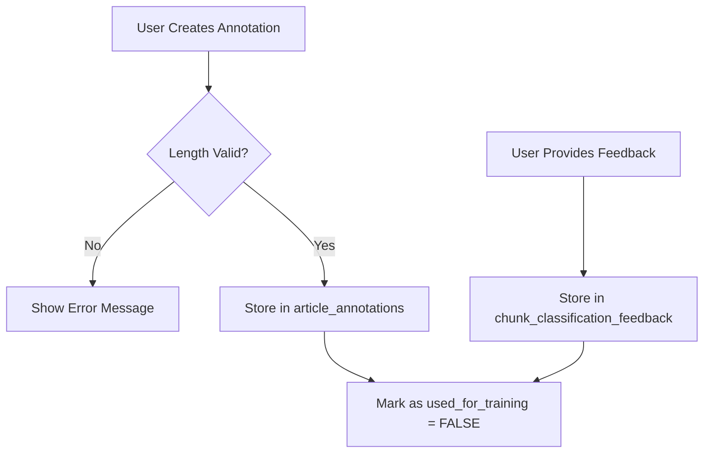
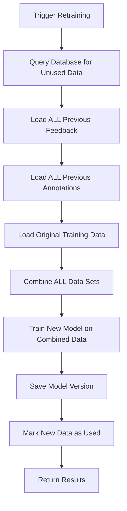

# Database-Based Training System

## Overview

The ML training system has been refactored to use database storage instead of CSV files for improved data management, consistency, and scalability.

**Migration Date**: 2025-10-18  
**Previous System**: CSV-based feedback storage  
**Current System**: Database-based with PostgreSQL

## Architecture

### Database Tables

#### 1. Chunk Classification Feedback
```sql
CREATE TABLE chunk_classification_feedback (
    id SERIAL PRIMARY KEY,
    article_id INTEGER NOT NULL REFERENCES articles(id) ON DELETE CASCADE,
    chunk_id INTEGER NOT NULL,
    chunk_text TEXT NOT NULL,
    model_classification VARCHAR(20) NOT NULL,
    model_confidence FLOAT NOT NULL,
    model_reason TEXT,
    is_correct BOOLEAN NOT NULL,
    user_classification VARCHAR(20),
    comment TEXT,
    used_for_training BOOLEAN NOT NULL DEFAULT FALSE,
    created_at TIMESTAMP WITHOUT TIME ZONE NOT NULL DEFAULT NOW(),
    updated_at TIMESTAMP WITHOUT TIME ZONE NOT NULL DEFAULT NOW()
);
```

**Purpose**: Stores user feedback on ML model predictions for chunk classification.

#### 2. Article Annotations (Training Data)
```sql
-- Existing table, now used for training
SELECT COUNT(*) FROM article_annotations 
WHERE LENGTH(selected_text) >= 950 
AND LENGTH(selected_text) <= 1050 
AND used_for_training = FALSE;
```

**Purpose**: Uses existing annotations as training data with length validation (950-1050 characters).

### Key Features

#### 1. Length Validation
<!-- AUDIT: Accuracy -- length validation in src/web/routes/annotations.py only applies when
     annotation_type is in ANNOTATION_MODE_TYPES["huntability"], not to every annotation type.
     Clarified below; verify against current ANNOTATION_MODE_TYPES if this changes. -->
- **Frontend**: JavaScript validation prevents huntability annotations <950 or >1050 characters
- **Backend**: API validation enforces the length requirement for huntability annotations
- **Purpose**: Ensures optimal training data quality

#### 2. Auto-Expand UI
- **Automatic Selection**: UI automatically expands text to 1000 characters
- **User Experience**: No manual adjustment needed
- **Consistency**: All annotations are optimal length for training

#### 3. Usage Tracking
- **`used_for_training` Flag**: Tracks which data has been used for training
- **Prevents Duplication**: Same data not used multiple times
- **Audit Trail**: Complete history of training data usage

## API Endpoints

### Feedback Management
```http
POST /api/feedback/chunk-classification
Content-Type: application/json

{
    "article_id": 123,
    "chunk_id": 0,
    "chunk_text": "malware sample text...",
    "model_classification": "Huntable",
    "model_confidence": 0.85,
    "is_correct": false,
    "user_classification": "Not Huntable",
    "comment": "User feedback"
}
```

### Annotation Creation
```http
POST /api/articles/{article_id}/annotations
Content-Type: application/json

{
    "annotation_type": "huntable",
    "selected_text": "1000 character text...",
    "start_position": 0,
    "end_position": 1000
}
```

**Validation**: Returns a 400 error if text length is <950 or >1050 characters, for huntability-type annotations only.

### Training Status
```http
GET /api/model/feedback-count

Response:
{
    "success": true,
    "count": 5,
    "feedback_count": 2,
    "annotation_count": 3,
    "message": "Found 5 training samples available (2 feedback + 3 annotations)"
}
```

### Model Retraining
```http
POST /api/model/retrain

Response:
{
    "success": true,
    "message": "Retraining completed successfully! New model: v57",
    "new_version": 57,
    "training_accuracy": 0.892,
    "training_samples": 5,
    "feedback_samples": 2,
    "annotation_samples": 3,
    "training_duration": "45.2s"
}
```

## Training Workflow

### 1. Data Collection


### 2. Model Retraining (Cumulative Learning)


<!-- AUDIT: Accuracy -- this section predates the 2026-05-22 quality-gate change
     (see docs/CHANGELOG.md). Retrain now writes to a staging path
     (models/content_filter_staging.pkl) and only promotes to the live model
     after it clears recall_huntable >= 0.30 and f1_huntable >= 0.30 on the
     curated eval set; a rejected retrain discards the staged model. See
     [ML Model Runbook](../operations/ml-model-runbook.md) [VERIFY LINK] for
     the current end-to-end procedure. -->
**Key Point: Cumulative Learning Process**
- Each retraining session uses **ALL previous data** (original + all previous feedback + all previous annotations)
- New feedback/annotations are **added to** the existing dataset, not replacing it
- This ensures progressive improvement and no data loss
- The model builds on all previous learning, becoming more robust over time

**Why This Matters:**
- **No Catastrophic Forgetting**: Previous model knowledge is preserved
- **Stable Learning**: Each retrain builds on solid foundation rather than starting fresh
- **Efficient Use of Data**: All user feedback contributes to model improvement
- **Progressive Accuracy**: Model accuracy improves with each retraining session
- **Small Batch Friendly**: Even small amounts of new feedback improve the model

### 3. Data Usage Tracking
```sql
-- Before training: Count available data
SELECT COUNT(*) FROM chunk_classification_feedback WHERE used_for_training = FALSE;
SELECT COUNT(*) FROM article_annotations 
WHERE LENGTH(selected_text) BETWEEN 950 AND 1050 
AND used_for_training = FALSE;

-- After training: Mark as used
UPDATE chunk_classification_feedback SET used_for_training = TRUE;
UPDATE article_annotations SET used_for_training = TRUE 
WHERE LENGTH(selected_text) BETWEEN 950 AND 1050;
```

## Fresh Install / Bootstrap

On a clean install or after a restore where `models/content_filter.pkl` is
missing, seed the model from the bundled eval article fixtures before annotating:

```bash
python3 scripts/seed_model.py
docker compose restart web
```

`seed_model.py` chunks the 57 fixture articles (across the six categories that ship both
`articles.json` and `ground_truth.json`) in `config/eval_articles_data/`,
labels each chunk against the ground-truth `expected_items`, and trains a
baseline RandomForest (F1 ≈ 0.69 huntable). The resulting pkl replaces
pattern-only classification immediately and improves with each retrain cycle.

Run `python3 scripts/seed_model.py --dry-run` to preview corpus stats without
training.

## Migration from CSV (historical)

The original training pipeline stored feedback in CSV files. That system was
replaced by database-backed storage (2025-10-18). No migration script is
needed for current installs; all feedback and annotations flow through the
database automatically.

### Backward Compatibility
- **CSV Files**: No longer used to store new feedback or annotations
<!-- AUDIT: Accuracy -- eval_set.csv is not static. seed_model.py invokes
     scripts/prepare_eval_set.py, which regenerates
     outputs/evaluation_data/eval_set.csv from config/labeled_chunks/. See
     [ML Model Runbook](../operations/ml-model-runbook.md) [VERIFY LINK]. -->
- **Evaluation Data**: `eval_set.csv` is regenerated by `scripts/prepare_eval_set.py` (run automatically from `seed_model.py`), not by the feedback/annotation training path
- **Bootstrap Baseline**: `models/seed_training_data.csv` (written by `seed_model.py`) serves as the initial corpus when no prior CSV baseline exists

## Benefits

### 1. Data Integrity
- **ACID Compliance**: Database transactions ensure data consistency
- **Foreign Keys**: Referential integrity with articles table
- **Audit Trail**: Complete history of all training data

### 2. Scalability
- **Indexed Queries**: Fast retrieval of training data
- **Concurrent Access**: Multiple users can provide feedback simultaneously
- **Storage Efficiency**: No duplicate data storage

### 3. User Experience
- **Auto-Expand**: Automatic 1000-character selection
- **Real-time Validation**: Immediate feedback on annotation length
- **Consistent Interface**: Same UI for all annotation types

### 4. Development
- **Type Safety**: SQLAlchemy models with proper typing
- **Query Optimization**: Database-level filtering and aggregation
- **Testing**: Easier to test with database fixtures

## Testing

### Updated Test Files
- `tests/api/test_model_endpoints_api.py` - API contract tests (`/api/model/retrain-status`, `/retrain`, `/eval-chunk-count`, `/feedback-count`, `/versions`)
- `tests/scripts/test_retrain_fallback.py` - Retrain baseline/fallback workflow tests

### New Test Coverage
- Database feedback storage
- Annotation length validation
- Training data counting
- Usage tracking

### Test Commands
```bash
# Run ML feedback/model API tests
docker exec cti_web python -m pytest tests/api/test_model_endpoints_api.py -v

# Run retraining fallback tests
docker exec cti_web python -m pytest tests/scripts/test_retrain_fallback.py -v
```

## Monitoring

### Key Metrics
- **Training Samples Available**: Count of unused feedback + annotations
- **Model Accuracy**: Performance on evaluation dataset
- **Data Quality**: Percentage of annotations meeting length requirements
- **Usage Rate**: How quickly training data is consumed

### Database Queries
```sql
-- Available training data
SELECT 
    (SELECT COUNT(*) FROM chunk_classification_feedback WHERE used_for_training = FALSE) as feedback_count,
    (SELECT COUNT(*) FROM article_annotations 
     WHERE LENGTH(selected_text) BETWEEN 950 AND 1050 
     AND used_for_training = FALSE) as annotation_count;

-- Training data quality
SELECT 
    COUNT(*) as total_annotations,
    COUNT(CASE WHEN LENGTH(selected_text) BETWEEN 950 AND 1050 THEN 1 END) as valid_length,
    ROUND(COUNT(CASE WHEN LENGTH(selected_text) BETWEEN 950 AND 1050 THEN 1 END) * 100.0 / COUNT(*), 2) as quality_percentage
FROM article_annotations;
```

## Future Enhancements

### 1. Advanced Analytics
- Training data quality metrics
- Model performance correlation with data quality
- User feedback effectiveness analysis

### 2. Data Management
- Bulk import/export capabilities
- Data archiving for old training sets
- Automated data quality checks

### 3. UI Improvements
- Training data visualization
- Quality metrics dashboard
- Batch annotation tools

## Conclusion

The database-based training system's key benefits:

- **Data Integrity**: ACID compliance and referential integrity
- **User Experience**: Auto-expand UI and real-time validation
- **Scalability**: Efficient database queries and concurrent access
- **Maintainability**: Type-safe models and comprehensive testing
- **Monitoring**: Built-in metrics and quality tracking

The system replaced CSV-based storage while keeping the CSV-based evaluation
path intact.

_Last updated: 2026-07-03_
_Last reviewed: 2026-09-01_
