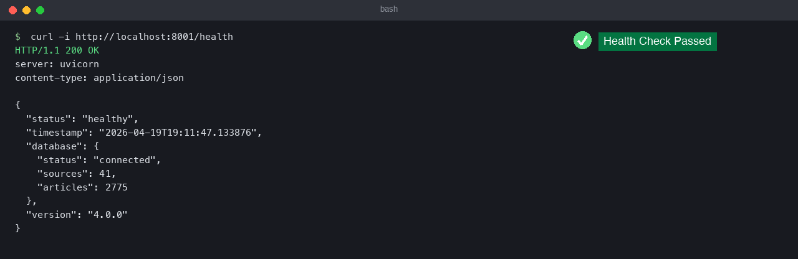
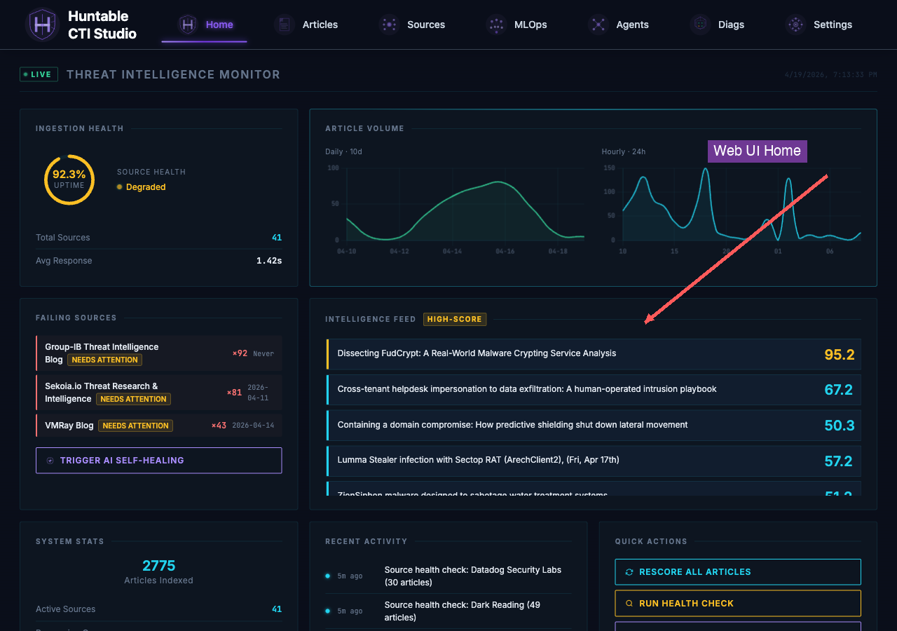
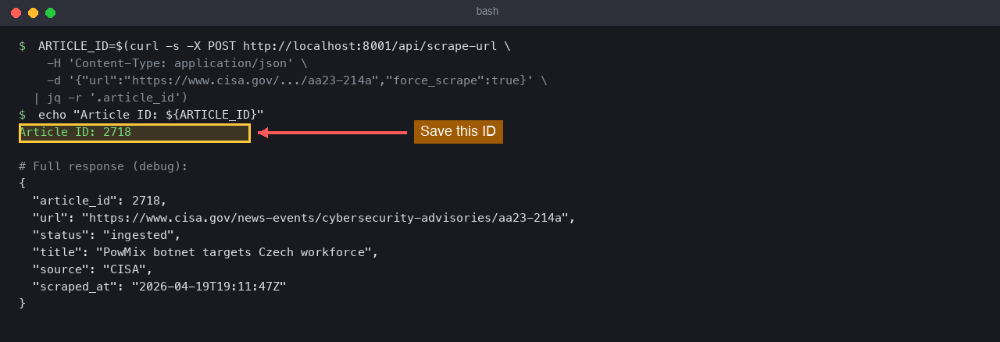
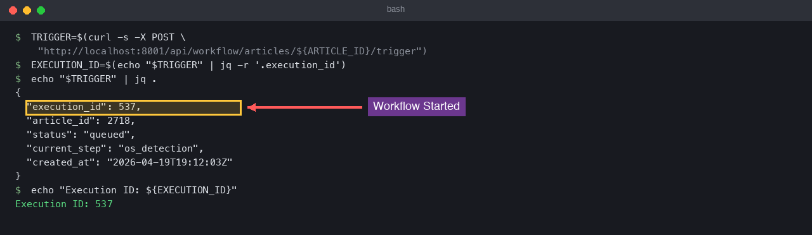
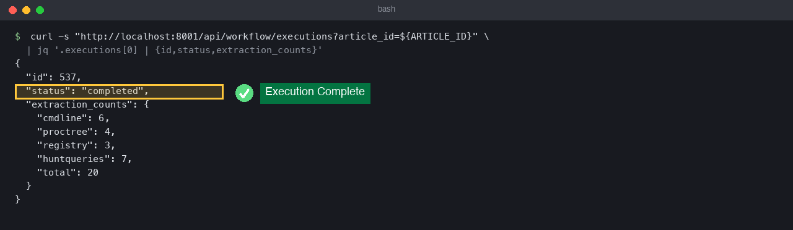
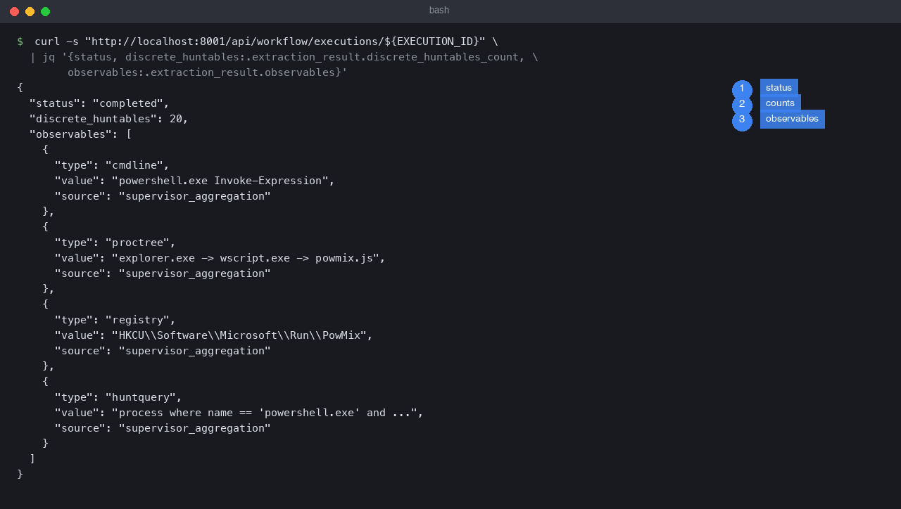
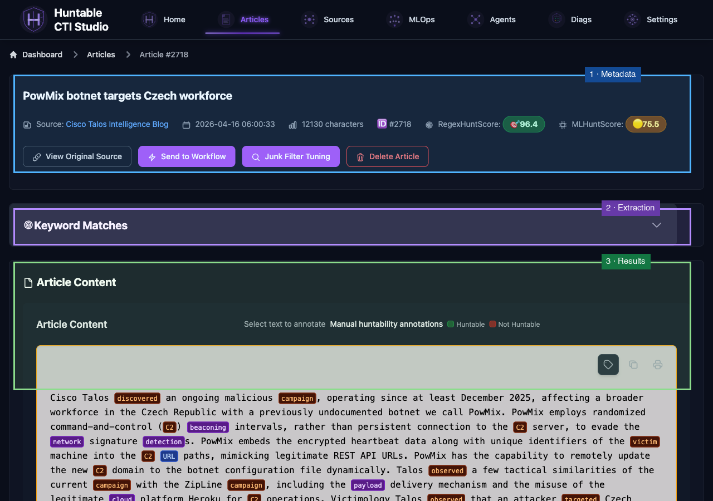
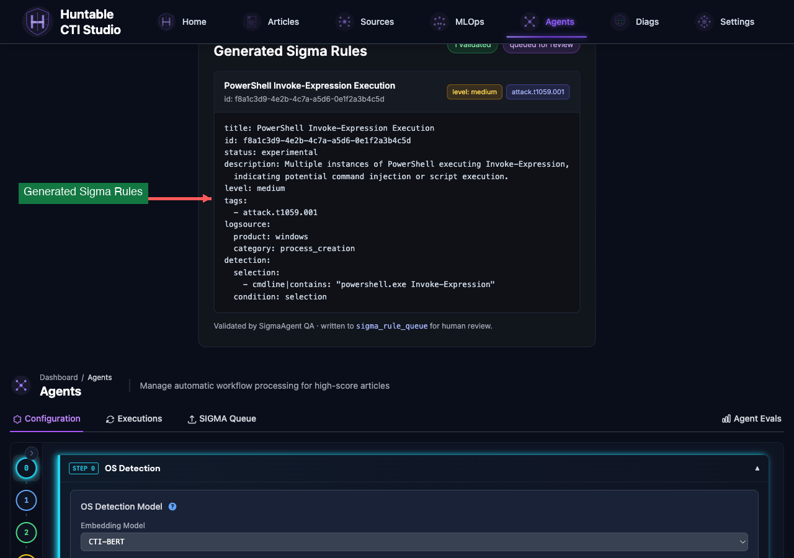
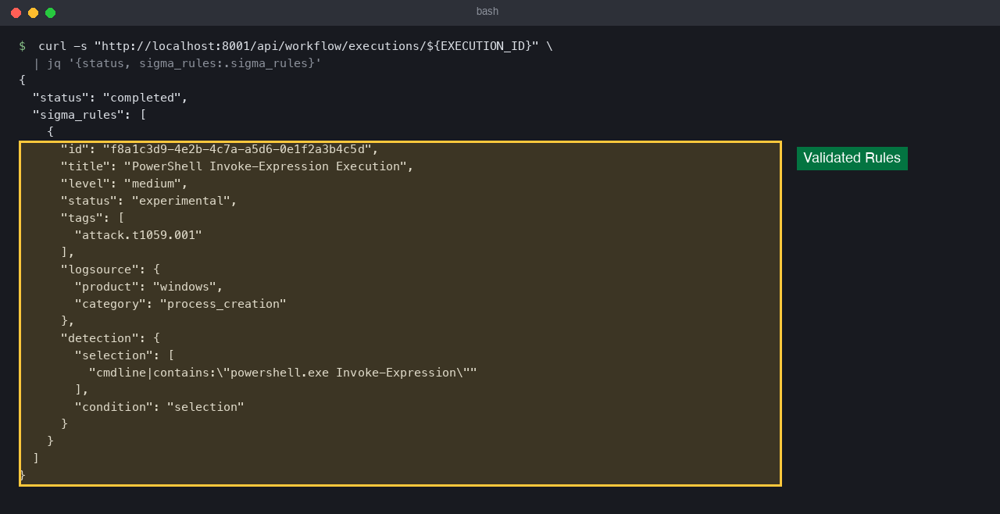
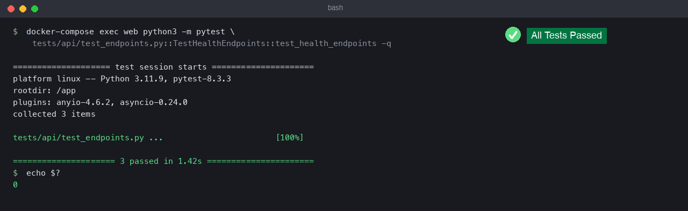

# Quickstart

**By the end of this guide you will have:**

1. Ingested a real CTI article (CISA advisory)
2. Run the full agentic workflow (OS detection → extraction → Sigma generation)
3. Viewed extracted huntables and validated Sigma rules
4. Confirmed the stack is healthy with pytest

Total time: ~5 minutes (plus initial Docker image build).

---

End-to-end run using Docker Compose and the built-in workflow. Commands use `python3` explicitly and match the live stack (`./start.sh`, ports 8001/8888).

## 1) Prerequisites
- Docker and the Docker Compose plugin available on your PATH
- `python3` for running tests, `jq` for parsing JSON responses
- Ports `8001` (web UI/API) and `8888` (auxiliary debug port) free on the host
- `.env` configured via `./setup.sh` (add LLM keys if you want AI features)

## 2) Start the stack
```bash
git clone https://github.com/dfirtnt/Huntable-CTI-Studio.git
cd Huntable-CTI-Studio
./setup.sh --no-backups
./start.sh                                    # builds + launches docker-compose
```
Check that services are healthy:
```bash
docker-compose ps
curl http://localhost:8001/health
```
UI entry points:
- Web UI + API docs: http://localhost:8001
- OpenAPI schema: http://localhost:8001/docs


*A `200 OK` from `/health` confirms the web container is reachable and the database is connected.*


*The dashboard at `http://localhost:8001` is the entry point for browsing articles, sources, and agent activity.*

## 3) Ingest a CTI article
Use the manual scrape endpoint to pull a real article into the database and capture its ID:
```bash
ARTICLE_ID=$(curl -s -X POST http://localhost:8001/api/scrape-url \
  -H 'Content-Type: application/json' \
  -d '{"url":"https://www.cisa.gov/news-events/cybersecurity-advisories/aa23-214a","force_scrape":true}' | jq -r '.article_id')
echo "Article ID: ${ARTICLE_ID}"
```


*Capture the returned `article_id` -- subsequent workflow calls reference it.*

## 4) Run the agentic workflow
Trigger the full pipeline (OS detection → junk filter → ranking → Extract Agent → Sigma → similarity search):
```bash
TRIGGER=$(curl -s -X POST "http://localhost:8001/api/workflow/articles/${ARTICLE_ID}/trigger")
EXECUTION_ID=$(echo "$TRIGGER" | jq -r '.execution_id')
```
If an execution is already running for the article, the API returns an error; wait for it to finish or clear the stuck run before retrying.


*The trigger endpoint returns an `execution_id` and queues the agent pipeline (OS detection -> ranking -> extract -> Sigma).*

## 5) Monitor and view huntables
Watch execution status and counts:
```bash
curl -s "http://localhost:8001/api/workflow/executions?article_id=${ARTICLE_ID}" | jq '.executions[0] | {id,status,extraction_counts}'
```
When `status` is `completed`, pull the detailed payload to see extracted observables (huntables):
```bash
curl -s "http://localhost:8001/api/workflow/executions/${EXECUTION_ID}" \
  | jq '{status, discrete_huntables:.extraction_result.discrete_huntables_count, observables:.extraction_result.observables}'
```
You can also review the article page at `http://localhost:8001/articles/${ARTICLE_ID}` (the "Reprocess" button mirrors the trigger above and the page surfaces extraction outputs).


*When `status` is `completed`, the run is done and `extraction_counts` summarises what each sub-agent produced.*


*Numbered fields: (1) overall status, (2) discrete huntable count, (3) observable array with type, value, and source agent.*


*The article page bundles (1) metadata, (2) keyword/extraction matches, and (3) annotated content -- the same data the workflow consumed.*

## 6) Review Sigma generation
The workflow writes validated Sigma rules to the same execution record. Inspect them via API or UI:
```bash
curl -s "http://localhost:8001/api/workflow/executions/${EXECUTION_ID}" \
  | jq '{status, sigma_rules:.sigma_rules}'
```
In the UI, open `http://localhost:8001/workflow#executions` and click **View** on the row matching `${EXECUTION_ID}` to see the validated Sigma YAML, logs, and similarity matches. (The article page at `/articles/${ARTICLE_ID}` surfaces the extracted observables but not the Sigma rules.)


*The Workflow page surfaces validated Sigma YAML for the run, plus level and ATT&CK technique tags.*


*The API returns the same validated rules with full Sigma structure (logsource, detection, condition).*

## 7) Verify with pytest
Run a lightweight API health test from the running web container:
```bash
docker-compose exec web python3 -m pytest tests/api/test_endpoints.py::TestHealthEndpoints::test_health_endpoints -q
```
A zero exit code confirms the stack and core health endpoints are working.


*All health-endpoint tests passing (`exit 0`) means the API surface and database wiring are operational.*

## 8) MCP server (optional)

For external LLM clients (Claude Desktop, IDE MCP, etc.), a **read-only** MCP server exposes article search, full article fetch, Sigma search, sources, workflow executions, and the Sigma review queue. It uses the same database as the web app. Tool listing and parameters: [MCP tools reference](reference/mcp-tools.md).

```bash
python3 run_mcp.py
# or: python3 -m src.huntable_mcp
```

Stack shutdown (optional):
```bash
docker-compose down
```

_Last updated: 2026-05-01_
