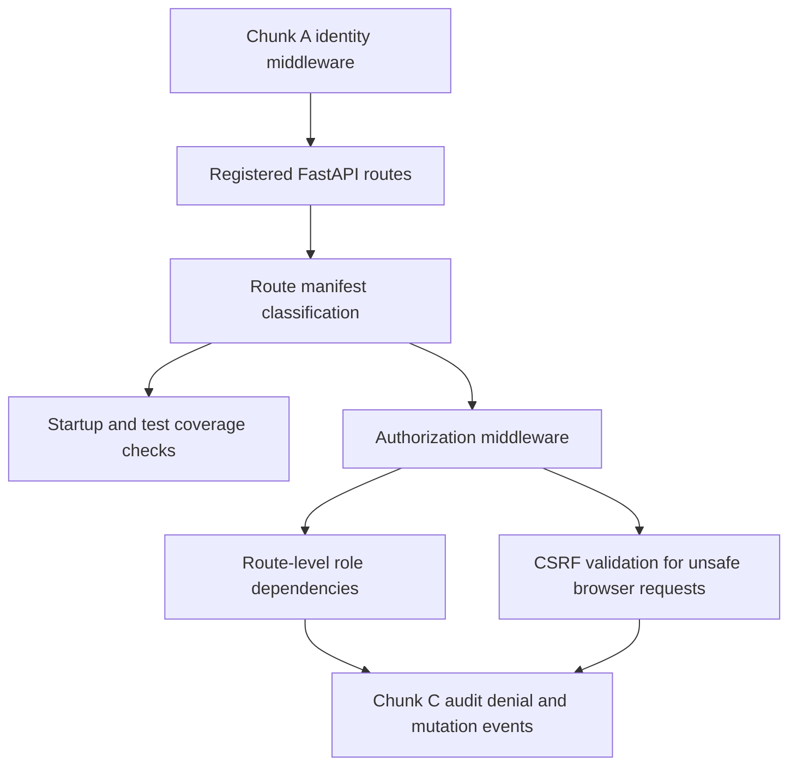

# Enterprise Auth Chunk B - Route Authorization Implementation Plan

> **For agentic workers:** REQUIRED SUB-SKILL: Use superpowers:subagent-driven-development (recommended) or superpowers:executing-plans to implement this plan task-by-task. Steps use checkbox (`- [ ]`) syntax for tracking.

**Goal:** Turn Chunk A's request identity into enforceable authorization: a route manifest covering the registered FastAPI surface, deny-by-default enforcement when auth is enabled, role gates on high-risk operations, and explicit CSRF handling for browser-originated unsafe requests.

**Architecture:** Keep route coverage data-driven and test-first. Add `src/web/security/route_manifest.py` for route classification and coverage checks, expand `src/web/security/permissions.py` into real FastAPI dependencies, add an authorization/CSRF middleware layer in `src/web/security/middleware.py`, and wire startup validation in `src/web/modern_main.py` after `register_routes(app)`. Apply route-level dependencies only where the route family needs role specificity; use the manifest/middleware as the broad guardrail.

**Tech Stack:** FastAPI/Starlette, route inspection from registered `app.routes`, FastAPI dependencies, Starlette middleware, signed CSRF tokens with `SECRET_KEY`, httpx `ASGITransport` for API tests, pytest / pytest-asyncio, `run_tests.py` runner.

**Spec:** [`docs/superpowers/specs/2026-06-17-enterprise-auth-chunk-b-route-authorization.md`](../specs/2026-06-17-enterprise-auth-chunk-b-route-authorization.md)

**Key constraints discovered during planning (do not violate):**
- Chunk A already provides `SECURITY_CONFIG`, `request.state.identity`, `RequestIdentity`, and inert permission helper import targets in `src/web/security/permissions.py`.
- Route enumeration must walk the app after `register_routes(app)`. Do not maintain route counts by parsing source files. The current route surface is broad: 36 modules and roughly 259 registered route decorators, with unsafe methods spread across settings, sources, backup/cron, workflow, Sigma, evaluation, model, scrape/PDF, annotations, and AI action routes.
- Existing tests intentionally assert no explicit FastAPI auth dependency on backup, cron, and source endpoints: `tests/api/test_backup_cron_api.py::test_backup_endpoints_require_no_admin_auth`, `tests/api/test_cron_api.py::test_cron_endpoints_require_no_admin_auth`, sibling source assertions in `tests/api/test_sources_routes.py`, and legacy source behavior in `tests/test_web_application.py`. Chunk B must rewrite these to the new contract instead of deleting them.
- Local development under `AUTH_MODE=disabled` must keep working through the synthetic local-dev admin identity. Auth-enabled development and production should fail closed on unclassified unsafe routes.
- `workflow.html` is already modified by unrelated work. If CSRF implementation must touch it, inspect and coordinate before editing; prefer a central browser fetch shim in `base.html` or static JS where possible.
- There is no existing `SECRET_KEY`, `itsdangerous`, `SessionMiddleware`, or centralized fetch helper. `base.html` is the shared template head/body shell, but fetch calls are scattered across templates and static JS.
- Public means very small: `/health`, `/api/health`, `/static/*`, and at most one minimal readiness path. Detailed health and diagnostics are not public.

---

## Route Authorization Shape

> *This illustrates the intended approach and is directional guidance for review, not implementation specification. The implementing agent should treat it as context, not code to reproduce.*

The broad middleware answers "is this route public, authenticated, or blocked by default?" Route dependencies answer "does this authenticated caller have the specific role for this high-risk operation?" CSRF is a browser-request constraint layered on unsafe methods, not a replacement for identity or role checks.

---

## File Structure

| File | Responsibility |
|---|---|
| `src/web/security/route_manifest.py` | Route classification records, public/authenticated/role/audit/CSRF metadata, route coverage validation, helpers for matching registered routes. |
| `src/web/security/permissions.py` | Real `require_authenticated`, `require_role`, `require_any_role`, and optional permission helper dependencies that raise 401/403. |
| `src/web/security/middleware.py` | Add authorization and CSRF middleware alongside Chunk A request-ID/identity middleware. |
| `src/web/security/config.py` | Add `SECRET_KEY` and CSRF env parsing/production fail-closed validation. |
| `src/web/modern_main.py` | Validate manifest after route registration; wire authorization/CSRF middleware with `SECURITY_CONFIG`. |
| `src/web/routes/*.py` | Add focused role dependencies for high-risk route groups, not blanket per-handler churn. |
| `src/web/templates/base.html` / static JS | Expose CSRF token and centralize unsafe same-origin fetch header injection. |
| `tests/unit/test_route_manifest.py` | Pure manifest matching and classification tests. |
| `tests/api/test_route_authorization.py` | In-process auth-enabled request/response contract tests. |
| `tests/api/test_csrf.py` | CSRF token issue/validation and browser/service distinction tests. |

---

### Task 1: Route manifest model and completeness tests

**Files:**
- Create: `src/web/security/route_manifest.py`
- Test: `tests/unit/test_route_manifest.py`, `tests/api/test_route_authorization.py`

- [ ] **Step 1: Write failing manifest tests**

Create focused tests that build a FastAPI app, call `register_routes(app)`, and assert:

- `/health`, `/api/health`, and `/static/{path:path}` are classified public.
- `/api/health/database`, `/api/health/services`, `/api/health/celery`, `/api/health/ingestion`, `/api/capabilities`, job/diagnostic routes, and debug routes are not public.
- Every unsafe method registered by the app has an explicit classification.
- The manifest reports route path, method, endpoint name, route module, classification, minimum roles, audit requirement, and CSRF requirement.
- A synthetic unclassified unsafe route causes the manifest validation helper to fail with a useful error naming method, path, and endpoint.

- [ ] **Step 2: Implement route classification types**

Add a small, typed model in `route_manifest.py`:

- classification: `public`, `authenticated`, `roles`
- roles: tuple of app role names, empty unless classification is `roles`
- audit requirement: `none`, `best_effort`, `mandatory`
- CSRF requirement: `required`, `not_required`, `service_only`, or equivalent explicit enum
- route key: method + normalized path, with support for FastAPI path parameters

Keep this module pure. It should not import `modern_main.py` or construct the application.

- [ ] **Step 3: Seed the manifest with the first full classification pass**

Classify the route surface using the spec's route protection table:

- public: only minimal liveness/static paths.
- authenticated: normal page reads, article/source/search reads, semantic search, export/download unless elevated by implementation review.
- operator/admin: source collection and source config mutations, cron/scheduled jobs, workflow trigger/retry/cancel/cleanup, embedding jobs, evaluation runs/backfills/diagnostics, default AI provider actions.
- rule_reviewer/admin: Sigma queue edit/approve/reject/bulk/enrich/validate/PR and Sigma comparison routes.
- analyst/operator/admin: scrape URL, PDF upload, ingest-triggering uploads.
- analyst/admin: annotation create/delete/update.
- admin: settings/credentials, backup create/download/restore/delete, model retrain/rollback/delete/version management, observable training, debug routes.
- operator/admin: detailed health/diagnostics, with only minimal `/health` and `/api/health` remaining public.

Where a route's risk is ambiguous, choose the stricter role from the parent spec and document it in the manifest comment or plan follow-up note.

- [ ] **Step 4: Add startup-safe validation helpers**

Expose helpers that can validate a registered FastAPI app after route registration. Behavior:

- Auth-enabled development and production fail on unclassified unsafe routes.
- `AUTH_MODE=disabled` development logs unclassified unsafe routes but keeps the current local workflow alive.
- Production startup always fails on unclassified unsafe routes.

**Patterns to follow:**
- `src/web/routes/__init__.py` for the single route registration surface.
- Chunk A's pure `src/web/security/config.py` style: deterministic helpers, small data types, direct tests.
- FastAPI APIRouter dependency support from the framework docs: route/router dependencies should be used where they reduce repetition without hiding route intent.

**Test scenarios:**
- Happy path: all current unsafe routes are classified and validation passes.
- Edge case: safe GET route without classification is allowed only if the global read policy will authenticate it or it is explicitly public.
- Error path: synthetic unsafe POST without classification fails validation in auth-enabled mode.
- Error path: detailed health path classified public fails a test that guards the public allowlist.
- Integration: an app built through `register_routes(app)` produces the same classification data the middleware will consume.

**Verification:**
- The manifest test is the source of truth for route coverage. A new unsafe route added later must fail tests until classified.

---

### Task 2: Permission helpers and auth-enabled denial behavior

**Files:**
- Modify: `src/web/security/permissions.py`, `src/web/security/middleware.py`, `src/web/modern_main.py`
- Test: `tests/api/test_route_authorization.py`, `tests/unit/test_security_permissions.py`

- [ ] **Step 1: Write failing dependency tests**

Cover the Chunk A stub behavior before changing it:

- `require_authenticated` returns the identity when authenticated and raises 401 when unauthenticated.
- `require_role("admin")` allows an admin and rejects a non-admin with 403.
- `require_any_role("operator", "admin")` allows either role and rejects unrelated roles.
- Admin role inheritance is honored consistently for the initial role model.
- Missing `request.state.identity` fails closed when auth enforcement is active.

- [ ] **Step 2: Implement real permission dependencies**

Keep the public helper names stable:

- `require_authenticated`
- `require_role("admin")`
- `require_any_role("operator", "admin")`
- `require_permission(...)` only if route roles prove too coarse during implementation

Use `HTTPException` with stable 401/403 behavior. Do not add API-key compatibility fallbacks. The old `ADMIN_API_KEY` path is not the enterprise auth model.

- [ ] **Step 3: Add broad authorization middleware**

Add middleware that:

- Reads the matched route's manifest entry.
- Lets public routes through without identity.
- Requires authenticated identity for non-public routes when auth is enabled.
- Denies unsafe methods without classification when fail-closed applies.
- Leaves `AUTH_MODE=disabled` local development compatible through Chunk A's synthetic admin identity.
- Returns JSON 401/403 for API paths and a minimal HTML/error response for page paths if the existing error handler pattern supports it.

- [ ] **Step 4: Wire validation and middleware in `modern_main.py`**

Run route manifest validation only after `register_routes(app)`, because the manifest must compare against actual registered routes. Keep middleware order deliberate:

- request ID outermost enough that denials include `X-Request-ID`
- identity available before authorization
- authorization/CSRF runs before route handlers

**Patterns to follow:**
- Existing Chunk A middleware classes in `src/web/security/middleware.py`.
- Existing exception style in route modules: `HTTPException` with concise `detail`.
- Starlette/FastAPI middleware behavior, keeping request state as the local handoff object.

**Test scenarios:**
- Happy path: `AUTH_MODE=trusted_header` with valid trusted headers can access an authenticated route.
- Error path: no identity in auth-enabled mode receives 401 on a non-public GET route.
- Error path: authenticated analyst receives 403 on admin-only settings mutation.
- Error path: authenticated operator receives 403 on Sigma approval route that requires `rule_reviewer` or `admin`.
- Integration: `AUTH_MODE=disabled` local development still permits the same route through synthetic admin identity.
- Integration: request denials still carry `X-Request-ID`.

**Verification:**
- Auth-enabled API tests prove the new denial contract without requiring a live server.

---

### Task 3: Migrate high-risk route groups to explicit role dependencies

**Files:**
- Modify: selected files in `src/web/routes/`
- Test: existing route-specific tests plus `tests/api/test_route_authorization.py`

- [ ] **Step 1: Update the old no-auth regression tests to the new contract**

Rewrite, do not delete:

- `tests/api/test_backup_cron_api.py::test_backup_endpoints_require_no_admin_auth`
- `tests/api/test_cron_api.py::test_cron_endpoints_require_no_admin_auth`
- source dependency assertions in `tests/api/test_sources_routes.py`
- affected expectations in `tests/test_web_application.py`

New contract:

- Handlers may use the enterprise permission helpers.
- Settings UI flows must succeed when the request has an authenticated identity with the required role.
- In auth-enabled mode, backup/cron/source unsafe endpoints reject unauthenticated requests.
- In `AUTH_MODE=disabled`, local-dev synthetic admin still preserves local operation.

- [ ] **Step 2: Apply role dependencies by route family**

Use router-level dependencies where the whole router shares a role, and route-level dependencies when read/write roles differ:

- `src/web/routes/settings.py`: settings and credentials writes require `admin`; reads authenticated unless the manifest elevates them.
- `src/web/routes/backup.py`: backup create/list/download/status/restore/delete and backup cron changes require `admin`.
- `src/web/routes/cron.py` and `src/web/routes/scheduled_jobs.py`: cron/scheduled jobs require `operator` or `admin`, unless backup-specific actions are already admin-only.
- `src/web/routes/sources.py`: source add/update/toggle/collect require `operator` or `admin`; source reads authenticated.
- `src/web/routes/workflow_executions.py` and `src/web/routes/workflow_config.py`: trigger/retry/cancel/cleanup/config mutations require `operator` or `admin`; config prompt/preset mutations should follow the same rule unless the implementation finds a stronger admin-only reason.
- `src/web/routes/sigma_queue.py`, `src/web/routes/sigma_ab_test.py`, `src/web/routes/sigma_similarity_test.py`: queue edit/approve/reject/bulk/enrich/validate/PR and similarity comparison actions require `rule_reviewer` or `admin`.
- `src/web/routes/annotations.py`: annotation create/update/delete require `analyst` or `admin`.
- `src/web/routes/models.py` and `src/web/routes/ml_hunt_comparison.py`: retrain/rollback/evaluate/backfill/version-management mutations require `admin`; read-only model status/version endpoints authenticated.
- `src/web/routes/embeddings.py`: rebuild/update/embed mutations require `operator` or `admin`.
- `src/web/routes/scrape.py` and `src/web/routes/pdf.py`: scrape URL, OCR extraction, and PDF upload require `analyst`, `operator`, or `admin`.
- `src/web/routes/evaluation.py`, `src/web/routes/evaluation_api.py`, `src/web/routes/observable_evaluation.py`: eval runs/backfills/diagnostics require `operator` or `admin`.
- `src/web/routes/observable_training.py`: training-data mutation requires `admin`.
- `src/web/routes/ai.py`, `src/web/routes/actions.py`, `src/web/llm_optimized_endpoint.py`: provider-invoking or state-changing AI actions default to `operator` or `admin`; article-local analytical actions may be elevated during implementation if the manifest identifies content mutation.
- `src/web/routes/export.py`: export remains authenticated per spec default unless implementation identifies content exfiltration risk requiring `analyst`.
- `src/web/routes/debug.py`: debug routes require `admin`.

- [ ] **Step 3: Gate detailed health and diagnostics**

Keep `/health` and `/api/health` public. Move detailed health, diagnostics, metrics that expose internals, job queues/history, and capabilities behind `operator` or `admin` unless a specific endpoint is proven to be minimal readiness.

**Patterns to follow:**
- Existing route module organization and function names. Avoid moving routes between modules.
- Use the helper dependencies from `src/web/security/permissions.py`; do not reintroduce one-off `X-API-Key` or `ADMIN_API_KEY` checks.

**Test scenarios:**
- Happy path: admin can update settings, backup config, and model rollback endpoints.
- Happy path: operator can collect a source, update scheduled jobs, retry/cancel workflow, and run eval backfill.
- Happy path: rule reviewer can approve/reject/edit Sigma queue items.
- Happy path: analyst can create/delete annotations and submit scrape/PDF uploads.
- Error path: analyst cannot update settings, backup, model rollback, or scheduled jobs.
- Error path: operator cannot approve Sigma queue items.
- Error path: unauthenticated trusted-header request cannot reach unsafe backup/cron/source endpoints.
- Integration: local `AUTH_MODE=disabled` continues to pass existing local route workflows through synthetic admin identity.

**Verification:**
- Route-family tests prove role specificity for representative endpoints. The manifest completeness test protects breadth.

---

### Task 4: SECRET_KEY and CSRF implementation

**Files:**
- Modify: `src/web/security/config.py`, `src/web/security/middleware.py`, `src/web/templates/base.html`, selected static JS if needed
- Create: optional `src/web/security/csrf.py`
- Test: `tests/unit/test_security_config.py`, `tests/api/test_csrf.py`, focused UI tests where affected

- [ ] **Step 1: Add config tests for `SECRET_KEY` and CSRF mode**

Cover:

- Production with cookie-backed CSRF enabled and missing/default `SECRET_KEY` fails startup.
- Production with a strong non-default `SECRET_KEY` passes.
- Non-production keeps current behavior unless CSRF is explicitly enabled.
- A documented bearer-only/cookieless mode sets CSRF inactive explicitly, not implicitly.

- [ ] **Step 2: Implement signed token issue and validation**

Use a small security module for CSRF helpers. Requirements:

- Signed tokens derive from `SECRET_KEY`.
- Tokens are exposed to rendered pages through `base.html` as a meta tag or stable JS global.
- Unsafe browser-originated requests must include `X-CSRF-Token`.
- Missing, malformed, or invalid token returns 403.
- Safe methods do not require CSRF.
- Non-browser service routes can be exempt only when they use explicit service identity or bearer/internal auth. Do not make "missing browser headers" a blanket bypass.

- [ ] **Step 3: Centralize browser fetch injection**

Because there is no central fetch helper and many templates call `fetch()` directly, prefer a central shim loaded from `base.html`:

- Preserve external fetches such as direct calls to `http://localhost:1234` or GitHub API; only add CSRF to same-origin unsafe requests.
- Preserve caller-supplied headers and credentials options.
- Add tests or static checks for representative templates: `settings.html`, `sources.html`, `sigma_queue.html`, `workflow_executions.html`, `article_detail.html`, and static annotation JS.
- Do not edit dirty `src/web/templates/workflow.html` until its current changes are reviewed; the shim should cover it without rewriting individual calls if possible.

**Patterns to follow:**
- `base.html` is the shared layout. Keep additions small and early enough that page scripts see the token/shim.
- OWASP CSRF guidance: protect state-changing requests with tokens when cookie-backed browser auth exists, and do not use GET for state-changing behavior.
- FastAPI/Starlette middleware patterns already used by Chunk A.

**Test scenarios:**
- Happy path: rendered page includes a CSRF token when CSRF is enabled.
- Happy path: same-origin POST with valid `X-CSRF-Token` succeeds when role requirements are met.
- Error path: same-origin POST without token fails 403 when CSRF is enabled.
- Error path: invalid token fails 403.
- Edge case: GET/HEAD/OPTIONS do not require CSRF.
- Integration: same-origin fetch shim adds token to POST/PUT/PATCH/DELETE without clobbering existing `Content-Type`.
- Integration: cross-origin fetches do not receive the CSRF token.

**Verification:**
- Browser-originated unsafe flows work with the token and fail without it.

---

### Task 5: Documentation and operator-facing contract

**Files:**
- Modify: `.env.example`, `docs/guides/authentication.md`
- Test: docs/static checks if present

- [ ] **Step 1: Document the route authorization model**

Update authentication docs with:

- public allowlist
- role names and intended capabilities
- group-to-role env vars from Chunk A
- deny-by-default behavior for unsafe routes
- local development `AUTH_MODE=disabled` behavior and its synthetic admin identity
- production fail-closed behavior for unclassified unsafe routes

- [ ] **Step 2: Document CSRF posture**

State whether the supported enterprise browser deployment is cookie-backed or bearer/cookieless. If cookie-backed, document:

- `SECRET_KEY` requirement
- token header name
- expected proxy/session behavior
- why CSRF protects browser-originated unsafe requests but does not replace role checks

If bearer-only is selected during implementation, document why CSRF is inactive and what prevents cross-site browser submission.

- [ ] **Step 3: Update env examples**

Add commented examples for:

- `SECRET_KEY`
- CSRF mode/config
- any public docs/openapi override if implemented
- route auth operational notes

**Patterns to follow:**
- Chunk A `docs/guides/authentication.md` tone: direct operator guidance, explicit insecure-production warnings.
- `.env.example` safe defaults with production warnings in comments.

**Test scenarios:**
- Test expectation: none for pure documentation, unless the repo has markdown or env sample checks.

**Verification:**
- Operators can configure production trusted-header auth plus route authorization without reading code.

---

### Task 6: Regression gate and cleanup

**Files:**
- Test: affected unit/API/UI suites
- Modify: only files needed to fix failures found by the focused regression gate

- [ ] **Step 1: Run focused tests first**

Use the repo runner and focus on the new and migrated tests:

- manifest and permission unit tests
- route authorization API tests
- CSRF API tests
- migrated backup/cron/source tests
- representative route-family tests for settings, Sigma queue, workflow, sources, backup, models, annotations, health

- [ ] **Step 2: Run broader API and UI gates**

Run the repo-supported API gate and focused UI/browser coverage for CSRF/fetch changes. UI verification matters because CSRF touches browser requests and templates.

- [ ] **Step 3: Keep unrelated changes isolated**

Before staging or committing, confirm unrelated pre-existing files remain untouched unless explicitly brought into this implementation. In particular:

- `src/web/templates/workflow.html` had unrelated local changes before this plan.
- `docs/superpowers/specs/2026-06-17-platform-telemetry-expansion-design.md` was untracked before this plan.

**Patterns to follow:**
- `AGENTS.md` runner contract: `python3 run_tests.py ...` for tests and `ruff check && ruff format --check` for lint.
- Stage files by explicit path only if committing.

**Test scenarios:**
- Integration: smoke/API gates show no regression in local disabled mode.
- Integration: auth-enabled representative tests prove new 401/403 behavior.
- Integration: CSRF browser flows pass with token and fail without token.

**Verification:**
- The change is shippable when Chunk B tests pass and the existing API/UI surface either passes or has clearly documented unrelated environment failures.

---

## Open Questions

### Resolved During Planning

- **Should backup/cron/source no-auth tests be deleted?** No. Rewrite them to encode the new enterprise auth contract so they remain regression guards for the UI path and the route protection model.
- **Should route coverage parse source files?** No. The manifest should compare against the registered FastAPI app after `register_routes(app)`, because that is the runtime contract.
- **Should detailed health remain public?** No. Only minimal liveness/readiness remains public; rich health/diagnostics require `operator` or `admin`.
- **Should CSRF be implicit?** No. Either implement it for cookie-backed browser auth or explicitly document why a bearer/cookieless deployment disables it.

### Deferred to Implementation

- **Exact export role:** The spec allows authenticated export initially but suggests elevation if content exfiltration risk warrants it. Start authenticated, then elevate to `analyst` if implementation review finds sensitive bulk export behavior.
- **Exact docs/openapi policy:** `/docs` and `/openapi.json` are not public in production unless explicitly configured. Implementation should decide whether to add an env override or simply classify them as authenticated.
- **Service-route CSRF exemptions:** Exemptions require explicit service identity or bearer/internal auth. Final exemption list depends on actual internal HTTP callers found during implementation.
- **Whether `require_permission(...)` is needed:** Start with roles. Add permissions only if a route family cannot be represented cleanly with the initial roles.

---

## System-Wide Impact

- **Interaction graph:** Request ID -> identity -> route manifest -> authorization -> role dependency -> CSRF -> route handler. Chunk C later consumes denial outcomes and mutation classifications for audit.
- **Error propagation:** API routes should receive stable 401/403 JSON responses; browser pages should avoid leaking internals and preserve request IDs.
- **State lifecycle risks:** Authorization denial must happen before mutation. CSRF denial must happen before mutation. Mandatory audit transaction work remains Chunk C.
- **API surface parity:** Browser pages, API endpoints, and background/service HTTP calls need distinct treatment; do not let CSRF exemptions become auth bypasses.
- **Integration coverage:** Unit tests cover manifest and helpers; API tests cover enforcement; UI/browser checks cover CSRF token propagation and fetch behavior.
- **Unchanged invariants:** Local `AUTH_MODE=disabled` remains usable. Chunk B does not add durable audit events, native login, password storage, SCIM, or per-user tenancy.

---

## Risks & Dependencies

| Risk | Mitigation |
|------|------------|
| Missed unsafe route remains unclassified | Manifest completeness test and startup validation fail closed in auth-enabled modes. |
| Role dependencies become noisy and inconsistent | Use manifest for broad policy and dependencies only for role-specific route families; prefer router-level dependencies when safe. |
| Existing UI breaks because old tests assumed no auth header | Rewrite backup/cron/source tests to assert authenticated enterprise identity and local disabled-mode compatibility. |
| CSRF patch requires editing hundreds of fetch calls | Add a base-template-loaded same-origin unsafe fetch shim; avoid manual per-call edits except for edge cases. |
| Dirty `workflow.html` conflict | Do not edit it blindly; rely on central shim or coordinate before touching the dirty file. |
| Service calls bypass CSRF by accident | Require explicit service identity or bearer/internal auth before any CSRF exemption. |
| Production starts with weak CSRF secret | Add `SECRET_KEY` fail-closed validation when CSRF is active/cookie-backed. |

---

## Documentation / Operational Notes

- Update `docs/guides/authentication.md` before shipping Chunk B so operators see the new route protection and CSRF contract.
- Keep Chunk C audit language clear: Chunk B may log denials, but durable `auth.request_denied` audit events land in Chunk C.
- Preserve the direct-access warning from Chunk A: trusted headers are only safe when the reverse proxy strips then sets identity headers and direct FastAPI access is blocked.

---

## Sources & References

- **Origin spec:** [`docs/superpowers/specs/2026-06-17-enterprise-auth-chunk-b-route-authorization.md`](../specs/2026-06-17-enterprise-auth-chunk-b-route-authorization.md)
- **Parent spec:** [`docs/superpowers/specs/2026-06-17-enterprise-auth-auditability-build-spec.md`](../specs/2026-06-17-enterprise-auth-auditability-build-spec.md)
- **Prior plan template:** [`docs/superpowers/plans/2026-06-17-enterprise-auth-chunk-a.md`](2026-06-17-enterprise-auth-chunk-a.md)
- **FastAPI dependencies:** [`Depends()` / dependencies reference](https://fastapi.tiangolo.com/reference/dependencies/)
- **FastAPI APIRouter dependencies:** [`APIRouter` dependencies parameter](https://fastapi.tiangolo.com/reference/apirouter/)
- **Starlette middleware:** [`Middleware`](https://starlette.dev/middleware/)
- **OWASP CSRF guidance:** [`Cross-Site Request Forgery Prevention Cheat Sheet`](https://cheatsheetseries.owasp.org/cheatsheets/Cross-Site_Request_Forgery_Prevention_Cheat_Sheet.html)
