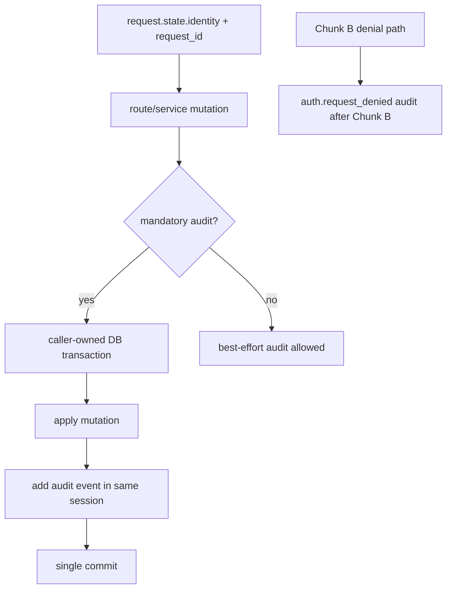

# Enterprise Auth Chunk C - Audit & Accountability Implementation Plan

> **For agentic workers:** REQUIRED SUB-SKILL: Use superpowers:subagent-driven-development (recommended) or superpowers:executing-plans to implement this plan task-by-task. Steps use checkbox (`- [ ]`) syntax for tracking.

**Goal:** Add durable, redacted, actor-attributed audit records for security-relevant and data-changing actions, with mandatory-audit transaction boundaries for high-risk mutations and explicit retention/export/tamper-risk controls.

**Architecture:** Build the audit foundation first (`AuditEventTable`, schema validation, `AuditService`/`AsyncAuditService`, redaction). Then migrate route families only when their mutation and audit write can share one caller-owned transaction. Chunk C must not mark a route enterprise-ready by adding a post-commit audit call. Denied-request audit wiring depends on Chunk B's authorization guard and should land only after that denial path exists.

**Tech Stack:** SQLAlchemy ORM, PostgreSQL JSONB, existing `create_tables()` idempotent schema path, sync and async DB sessions, FastAPI routes, Chunk A request identity, Chunk B authorization denial path once available, pytest, `run_tests.py` runner.

**Spec:** [`docs/superpowers/specs/2026-06-17-enterprise-auth-chunk-c-audit-accountability.md`](../specs/2026-06-17-enterprise-auth-chunk-c-audit-accountability.md)

**Adversarial review findings baked into this plan:**
- Chunk C depends on Chunk B for route denials and final auth roles, but Chunk B is not implemented yet. Implement only the audit table/service foundation and route-family transaction refactors that can be safely tested without Chunk B; defer denial wiring until Chunk B's guard exists.
- The highest-risk failure mode is false accountability: mutation commits successfully, audit write fails later, and the UI still reports success. Mandatory audit must share one transaction with the mutation or the route stays not enterprise-ready.
- Existing sync and async database managers open and commit internally in many helpers. Do not casually wrap those helpers from route code and assume atomicity.
- Audit metadata can become a new secret leak. Redaction must be recursive, default-deny for suspicious key names, and tested against nested dict/list payloads, headers, provider payloads, connection strings, and session cookies.
- The spec says table creation uses `create_tables()`, not Alembic. Both `src/database/async_manager.py` and `src/database/manager.py` maintain schema-ensure paths; keep them consistent.
- PostgreSQL has a user-visible `metadata` concept in SQLAlchemy declarative classes. Avoid naming ORM attributes in a way that conflicts with SQLAlchemy declarative internals; map the DB column explicitly if needed.
- Phase-one DB-backed audit is mutable by DBAs. Docs must not call it immutable; they should recommend exporting to SIEM/log infrastructure for higher assurance.

---

## Audit Flow Shape

> *This illustrates the intended approach and is directional guidance for review, not implementation specification. The implementing agent should treat it as context, not code to reproduce.*

The mandatory path has one success condition: mutation and audit event commit together. If that cannot be proven for a route family, leave that family outside enterprise-ready mandatory-audit scope until the service boundary is refactored.

---

## File Structure

| File | Responsibility |
|---|---|
| `src/database/models.py` | Add `AuditEventTable` with JSONB details and indexes. |
| `src/database/async_manager.py` | Async schema creation and production schema validation. |
| `src/database/manager.py` | Sync schema creation parity for code paths that instantiate `DatabaseManager`. |
| `src/services/audit_service.py` | Action constants, redaction helpers, audit event builders, sync/async record methods. |
| `src/web/routes/*` | Route-family audit migration only after transaction sharing is proven. |
| `src/worker/celery_app.py` and scheduler/CLI entrypoints | Service identity and initiating-human metadata propagation where applicable. |
| `tests/unit/test_audit_service.py` | Redaction, event construction, sync/async service behavior. |
| `tests/unit/test_audit_schema.py` | ORM model/index/schema validation helper tests. |
| `tests/api/test_audit_routes.py` | Audit read/export/retention permissions once Chunk B route roles exist. |
| `tests/api/test_audit_mutations.py` | Representative success/failure/rollback route-family tests. |

---

### Task 1: Audit table and required schema validation

**Files:**
- Modify: `src/database/models.py`, `src/database/async_manager.py`, `src/database/manager.py`
- Test: `tests/unit/test_audit_schema.py`

- [x] **Step 1: Write failing schema/model tests**

Create tests that assert:

- `AuditEventTable.__tablename__ == "audit_events"`.
- Required columns exist: `id`, `created_at`, `request_id`, `actor_type`, `actor_id`, `actor_email`, `actor_roles`, `source_ip`, `user_agent`, `action`, `target_type`, `target_id`, `status`, `summary`, `metadata`, `before_hash`, `after_hash`, `error_code`.
- Required indexes exist on `created_at`, `actor_id`, `action`, `request_id`, and `(target_type, target_id)`.
- The Python ORM attribute for the DB `metadata` column does not break SQLAlchemy declarative metadata.
- A schema validation helper reports missing table/indexes with concrete names.

- [x] **Step 2: Add `AuditEventTable`**

Use the parent spec field set. Store actor roles and event metadata as JSONB. Use UUID primary key consistent with the repo's PostgreSQL UUID import. Keep summary compact and human-readable. Keep action/status strings indexed enough for audit queries without over-indexing every metadata field.

- [x] **Step 3: Keep sync/async schema paths consistent**

`Base.metadata.create_all` should create the table and model-declared indexes on new installs. Add any required idempotent `CREATE INDEX IF NOT EXISTS` or validation helpers in both schema paths if model indexes are not enough for existing installs.

- [x] **Step 4: Add production startup validation hook**

Add helper(s) that verify required audit schema objects. Production should fail if required table/indexes are missing. Non-production may log a clear error or raise only when explicitly requested by tests.

**Patterns to follow:**
- Existing `create_tables()` lock-timeout comments and idempotent DDL in `src/database/async_manager.py` and `src/database/manager.py`.
- Current SQLAlchemy model style in `src/database/models.py`.

**Test scenarios:**
- Happy path: model metadata contains the table and all required indexes.
- Error path: validation helper returns or raises a concrete missing-table error.
- Error path: validation helper returns or raises concrete missing-index errors.
- Integration: async and sync schema code reference the same required audit schema definitions.

**Verification:**
- A new install creates `audit_events`; production validation cannot silently skip missing required audit schema.

---

### Task 2: Audit service, redaction, and event contracts

**Files:**
- Create: `src/services/audit_service.py`
- Test: `tests/unit/test_audit_service.py`

- [x] **Step 1: Write failing redaction tests**

Cover nested dicts/lists and suspicious key names:

- API keys, GitHub tokens, provider credentials, passwords, connection strings, session cookies, Authorization headers, and raw provider request/response payloads are removed or replaced with redacted markers.
- Secret changes can be represented as presence/change booleans and hashes without storing raw values.
- Redaction preserves safe identifiers such as source IDs, article IDs, model names, prompt names, Sigma rule IDs, counts, and target IDs.

- [x] **Step 2: Define stable action/status constants**

Include the parent action set:

- `auth.request_authenticated`, `auth.request_denied`
- `settings.updated`, `settings.secret_updated`
- `source.updated`, `source.toggled`, `source.collection_requested`
- `scheduled_jobs.updated`
- `workflow.triggered`, `workflow.retried`, `workflow.cancelled`, `workflow.stale_cleanup_requested`
- `sigma_queue.rule_edited`, `sigma_queue.rule_approved`, `sigma_queue.rule_rejected`, `sigma_queue.bulk_action`, `sigma_queue.rule_enriched`, `sigma_queue.rule_validated`, `sigma_queue.pr_submitted`
- `annotation.created`, `annotation.deleted`
- `export.created`
- `debug.action_invoked`
- `audit.exported`, `audit.retention_applied`

- [x] **Step 3: Implement sync and async mandatory record methods**

Provide `AuditService.record_mandatory(session, event)` and `AsyncAuditService.record_mandatory(session, event)` that require a caller-owned session and add the event without committing independently. Add best-effort helpers only where the plan explicitly allows them.

- [x] **Step 4: Build request identity extraction helpers**

Create helpers that convert `RequestIdentity` plus request metadata into actor fields:

- `actor_type`
- `actor_id`
- `actor_email`
- `actor_roles`
- `request_id`
- `source_ip`
- `user_agent`

Service identities from Chunk A should produce `actor_type="service"` and service IDs. Unknown unauthenticated actors should remain explicit, not silently converted to local-dev.

**Patterns to follow:**
- Chunk A `RequestIdentity` fields in `src/web/security/identity.py`.
- Existing service modules' lightweight dataclass/pure-helper style.

**Test scenarios:**
- Happy path: human identity produces a complete event with actor, request ID, action, target, status, summary, and redacted metadata.
- Happy path: service identity produces service actor fields.
- Error path: mandatory record rejects missing caller-owned session.
- Error path: redaction handles nested secrets and raw provider payloads.
- Integration: sync and async services add `AuditEventTable` rows without committing.

**Verification:**
- The audit service can be used inside an existing transaction without hidden commits or secret leakage.

---

### Task 3: Transaction-boundary inventory and migration gates

**Files:**
- Modify: route/service files only as each family is migrated
- Test: route-family tests introduced with each migration

- [ ] **Step 1: Inventory mutation route families before editing**

For each mandatory-audit family, document whether the mutation currently:

- uses `async_db_manager.get_session()`
- uses `DatabaseManager.get_session()`
- calls a service method that commits internally
- dispatches a worker before or after commit
- writes files or invokes subprocesses outside the DB transaction

- [ ] **Step 2: Mark unrefactored mandatory routes as not enterprise-ready if needed**

If a route cannot share mutation and audit in one transaction yet, do not add a fake audit call after commit. Either refactor the service to accept a caller-owned session or keep the route blocked/not-enterprise-ready in auth-enabled production once Chunk B policy supports that state.

- [ ] **Step 3: Add transaction-sharing helper patterns**

Prefer small helper functions that accept a session over route handlers that manually duplicate database logic. Avoid broad database-manager rewrites unless a narrow session-accepting overload is enough.

**Patterns to follow:**
- Existing route tests that mock `async_db_manager.get_session()` and `DatabaseManager.get_session()`.
- Existing rollback tests around model/versioning and workflow execution failure paths.

**Test scenarios:**
- Error path: audit write failure rolls back the representative mutation.
- Error path: mutation failure does not create a success audit event.
- Integration: worker dispatch does not happen before the mandatory transaction commits.
- Integration: each migrated family has one success and one denied/failure audit scenario.

**Verification:**
- The inventory prevents accidental "log after commit" implementations.

---

### Task 4: First mandatory route-family migrations

**Files:**
- Modify: `src/web/routes/settings.py`, `src/web/routes/scheduled_jobs.py`, `src/web/routes/sigma_queue.py`, `src/web/routes/workflow_executions.py` as selected
- Test: `tests/api/test_audit_mutations.py` plus existing route tests

- [ ] **Step 1: Start with a narrow family that already owns its session**

Prefer settings or scheduled jobs if implementation confirms the route can share mutation and audit in a single async session. Add one route-family success and failure/rollback test before widening.

- [ ] **Step 2: Add compact, redacted summaries**

For secrets and settings, audit field names and presence/change booleans only. For bulk actions, audit counts and target IDs, not raw payloads.

- [ ] **Step 3: Widen family-by-family**

Proceed only after the prior route family has passing focused tests. Candidate order:

1. settings and secrets
2. scheduled jobs
3. workflow cancel/cleanup/retry
4. Sigma approve/reject/bulk/PR
5. source config mutations
6. annotations/export/debug

**Patterns to follow:**
- Existing route module style and tests for each family.
- Audit action constants from `src/services/audit_service.py`.

**Test scenarios:**
- Happy path: selected mutation writes one success audit event with actor and target.
- Error path: audit insert failure rolls back selected mutation.
- Error path: route/service mutation failure writes failure audit only when it can be safely written without claiming mutation success.
- Integration: denied events wait for Chunk B denial path unless that path exists.

**Verification:**
- Each migrated family proves atomicity before being considered enterprise-ready.

---

### Task 5: Denied-request audit and service/worker identities

**Files:**
- Modify: Chunk B authorization denial code once present, `src/worker/celery_app.py`, scheduler/CLI entrypoints, workflow metadata handoff points
- Test: `tests/api/test_audit_denials.py`, worker/service tests

- [ ] **Step 1: Wire `auth.request_denied` after Chunk B exists**

Once Chunk B has a single denial path, emit one denied event for unsafe permission denials and auth denials. Do not duplicate denial events in both middleware and route dependencies.

- [ ] **Step 2: Attach service identities**

Use the Chunk A service identity constants for worker/scheduler/CLI audit events. Internal HTTP service calls must use an explicit service identity header or internal auth path, not spoofed human trusted headers.

- [ ] **Step 3: Carry initiating human identity into async work**

When a user triggers a workflow or task, persist enough initiating actor metadata to attribute later worker-side audit events without pretending the worker is the human.

**Patterns to follow:**
- `src/web/security/identity.py` service identity constants.
- Existing workflow execution/task metadata fields in `AgenticWorkflowExecutionTable`.

**Test scenarios:**
- Happy path: denied unsafe route emits one `auth.request_denied` event.
- Edge case: a route dependency denial and middleware denial do not double-write.
- Integration: workflow retry/cancel carries initiating actor metadata to the worker path when available.
- Integration: worker audit uses `actor_type="service"` with initiating-human metadata in event details.

**Verification:**
- Denial and worker accountability work without trusted-header spoofing.

---

### Task 6: Audit read/export/retention and docs

**Files:**
- Modify or create audit routes if needed, `.env.example`, `docs/guides/authentication.md`
- Test: `tests/api/test_audit_routes.py`

- [ ] **Step 1: Add read/export/retention controls**

Audit read, export, and retention deletion require `admin` once Chunk B role gates exist. Operator may see readiness only through detailed health, not audit contents.

- [ ] **Step 2: Add retention behavior**

Parse `AUDIT_RETENTION_DAYS` with default `365`. Retention deletion is never automatic in local dev and emits `audit.retention_applied`.

- [ ] **Step 3: Document tamper risk honestly**

Docs must state phase-one audit is DB-backed and mutable by DBAs. Recommend forwarding DB logs/audit exports to SIEM or other append-only infrastructure for higher assurance.

**Patterns to follow:**
- Chunk A/B authentication docs and `.env.example` style.

**Test scenarios:**
- Happy path: admin can read/export audit events.
- Error path: non-admin cannot read/export/retention-delete audit events.
- Happy path: retention deletion removes only older events and emits `audit.retention_applied`.
- Error path: local dev does not run automatic retention deletion.

**Verification:**
- Operators understand what the audit trail proves and what it does not prove.

---

## Open Questions

### Resolved During Planning

- **Can Chunk C fully ship before Chunk B?** No. The audit schema/service foundation can begin, but denial auditing and role-protected audit routes wait for Chunk B.
- **Should route mutations log after commit if transaction sharing is hard?** No. That creates false accountability for mandatory-audit actions.
- **Should audit metadata store raw before/after payloads?** No. Store redacted summaries and hashes where needed.
- **Should phase-one audit be described as immutable?** No. It is DB-backed and mutable by DBAs.

### Deferred to Implementation

- **Exact first route family to migrate:** Choose after confirming transaction ownership in code. Prefer the narrowest family with a caller-owned session.
- **Schema validation strictness outside production:** Production must fail. Tests may exercise strict mode directly; local development should avoid noisy startup failure unless configured.
- **Whether a dedicated audit route module is needed:** Add only if read/export/retention cannot fit existing route organization cleanly.

---

## System-Wide Impact

- **Interaction graph:** request identity -> route/service mutation -> audit event builder -> shared DB transaction -> optional worker/service continuation.
- **Error propagation:** mandatory audit failure must fail the mutation before commit; best-effort audit failure may log only for non-mandatory events.
- **State lifecycle risks:** worker dispatch, subprocess calls, file writes, and external PR submissions cannot be rolled back by DB transaction alone. Audit those with explicit status and avoid claiming atomicity where it is not true.
- **API surface parity:** sync routes/services, async routes/services, workers, scheduler, and CLI need consistent actor/event vocabulary.
- **Integration coverage:** unit tests prove service/redaction; integration/API tests prove transaction rollback and route-family behavior.
- **Unchanged invariants:** No native identity provider, no immutable ledger, no per-user tenancy, and no Chunk B denial assumptions until Chunk B exists.

---

## Risks & Dependencies

| Risk | Mitigation |
|------|------------|
| Chunk C starts before Chunk B is complete | Implement audit foundation first; explicitly defer denial wiring and role-protected audit routes until Chunk B exists. |
| Mandatory audit is accidentally post-commit | Require caller-owned sessions in audit service and add rollback tests for each migrated route family. |
| Existing services hide internal commits | Inventory each route family before migration and refactor services to accept caller-owned sessions before marking enterprise-ready. |
| Audit logs leak secrets | Recursive redaction, suspicious-key default deny, and nested payload tests. |
| Schema validation drifts between sync and async managers | Share required schema constants/helpers and test both paths reference them. |
| DB-backed audit is mistaken for tamper-proof logging | Documentation explicitly states DBA tamper risk and recommends SIEM/export. |
| Worker audit misattributes human actions to workers or vice versa | Use service identity as actor and carry initiating-human metadata separately. |

---

## Documentation / Operational Notes

- Update `.env.example` with `AUDIT_RETENTION_DAYS=365` and any strict-schema validation toggles introduced.
- Update `docs/guides/authentication.md` with audit event scope, retention, export, and tamper-risk language.
- External references used for the plan: OWASP Logging Cheat Sheet, OWASP Secrets Management Cheat Sheet, OWASP Top 10 A09 logging/monitoring guidance, and NIST SP 800-92 log management guidance.

---

## Sources & References

- **Origin spec:** [`docs/superpowers/specs/2026-06-17-enterprise-auth-chunk-c-audit-accountability.md`](../specs/2026-06-17-enterprise-auth-chunk-c-audit-accountability.md)
- **Parent spec:** [`docs/superpowers/specs/2026-06-17-enterprise-auth-auditability-build-spec.md`](../specs/2026-06-17-enterprise-auth-auditability-build-spec.md)
- **Chunk A plan:** [`docs/superpowers/plans/2026-06-17-enterprise-auth-chunk-a.md`](2026-06-17-enterprise-auth-chunk-a.md)
- **Chunk B plan:** [`docs/superpowers/plans/2026-06-17-enterprise-auth-chunk-b.md`](2026-06-17-enterprise-auth-chunk-b.md)
- **OWASP Logging Cheat Sheet:** [`Logging Cheat Sheet`](https://cheatsheetseries.owasp.org/cheatsheets/Logging_Cheat_Sheet.html)
- **OWASP Secrets Management Cheat Sheet:** [`Secrets Management Cheat Sheet`](https://cheatsheetseries.owasp.org/cheatsheets/Secrets_Management_Cheat_Sheet.html)
- **OWASP Top 10 A09:** [`Security Logging and Monitoring Failures`](https://owasp.org/Top10/2021/A09_2021-Security_Logging_and_Monitoring_Failures/)
- **NIST SP 800-92:** [`Guide to Computer Security Log Management`](https://csrc.nist.gov/pubs/sp/800/92/final)
